# Bug Reports по результатам скриншотного тестирования

___
**ID**: BR1

**Заголовок**:

В поле Co2 отображается отрицательное значение -500 кг

**Окружение**:

ОС: Windows 10 64-bit
Браузер: Google Chrome 120.0.6099.109, разрешение 1920х1080

**Приоритет**

Средний

**Шаги**:

Открыть DevTools

Включить перезапись запросов: Sources/Overrides, чек-бокс Enable Local Overrides

Настроить перезапись ответа от роута `/web/1/charity/ecoImpact/init`
на body

`{"result":{"blocks":{"personalImpact":{"data":{"co2":-500,"energy":0,"water":0,"materials":0,"pineYears":0}}},"isAuthorized":true},"status":"ok"}`

Открываем страницу https://www.avito.ru/avito-care/eco-impact

**Ожидаемый результат**:

Верстка отображается корректно
В блоке Co2 отображается 0 кг

**Фактический результат**:

___
**ID**: BR2

**Заголовок**:

В поле Co2 отображается отрицательное значение -2 кг

**Окружение**:

ОС: Windows 10 64-bit
Браузер: Google Chrome 120.0.6099.109, разрешение 1920х1080

**Приоритет**

Средний

**Шаги**:

Открыть DevTools

Включить перезапись запросов: Sources/Overrides, чек-бокс Enable Local Overrides

Настроить перезапись ответа от роута `/web/1/charity/ecoImpact/init`
на body

`{"result":{"blocks":{"personalImpact":{"data":{"co2":-2,"energy":0,"water":0,"materials":0,"pineYears":0}}},"isAuthorized":true},"status":"ok"}`

Открываем страницу https://www.avito.ru/avito-care/eco-impact

**Ожидаемый результат**:

Верстка отображается корректно
В блоке Co2 отображается 0 кг

**Фактический результат**:

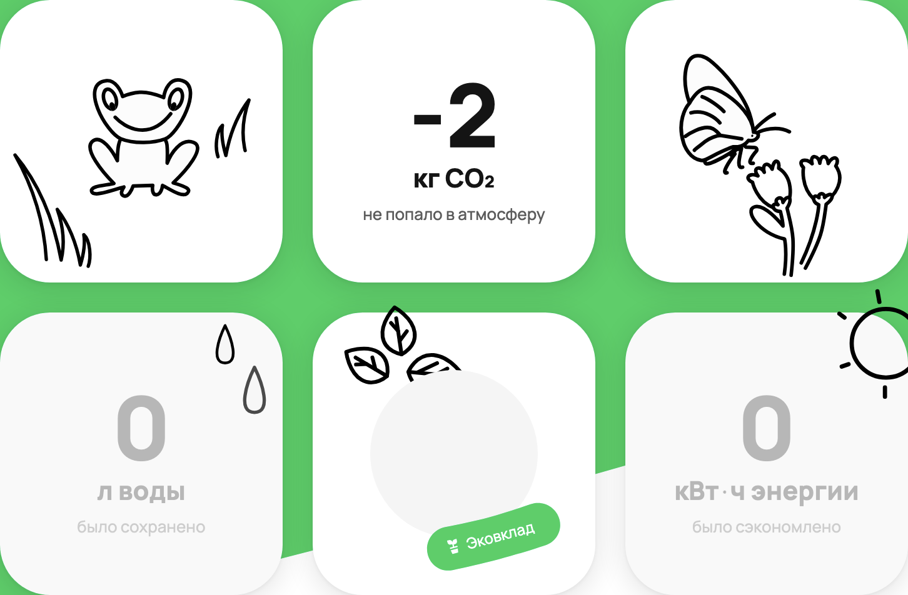

___
**ID**: BR3

**Заголовок**:

В поле Co2 отображается отрицательное значение -1 кг

**Окружение**:

ОС: Windows 10 64-bit
Браузер: Google Chrome 120.0.6099.109, разрешение 1920х1080

**Приоритет**

Средний

**Шаги**:

Открыть DevTools

Включить перезапись запросов: Sources/Overrides, чек-бокс Enable Local Overrides

Настроить перезапись ответа от роута `/web/1/charity/ecoImpact/init`
на body

`{"result":{"blocks":{"personalImpact":{"data":{"co2":-1,"energy":0,"water":0,"materials":0,"pineYears":0}}},"isAuthorized":true},"status":"ok"}`

Открываем страницу https://www.avito.ru/avito-care/eco-impact

**Ожидаемый результат**:

Верстка отображается корректно
В блоке Co2 отображается 0 кг

**Фактический результат**:

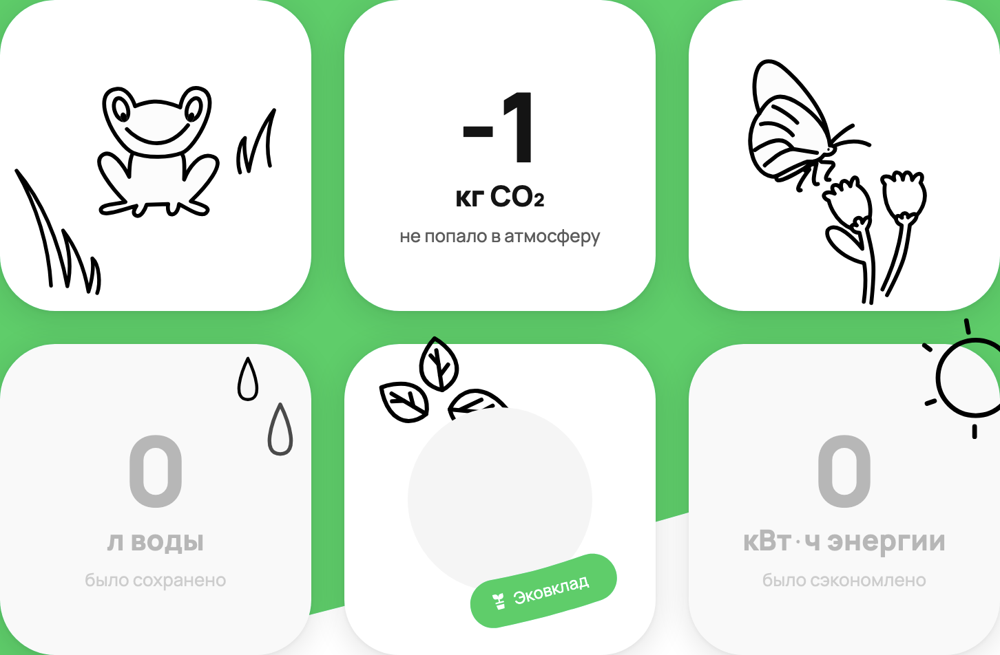

___
**ID**: BR4

**Заголовок**:

В поле Co2 некорректно конвертируется значение 1000000 кг

**Окружение**:

ОС: Windows 10 64-bit
Браузер: Google Chrome 120.0.6099.109, разрешение 1920х1080

**Приоритет**

Низкий

**Шаги**:

Открыть DevTools

Включить перезапись запросов: Sources/Overrides, чек-бокс Enable Local Overrides

Настроить перезапись ответа от роута `/web/1/charity/ecoImpact/init`
на body

`{"result":{"blocks":{"personalImpact":{"data":{"co2":1000000,"energy":0,"water":0,"materials":0,"pineYears":0}}},"isAuthorized":true},"status":"ok"}`

Открываем страницу https://www.avito.ru/avito-care/eco-impact

**Ожидаемый результат**:

Верстка отображается корректно
В блоке Co2 отображается 1 тыс тонн

**Фактический результат**:

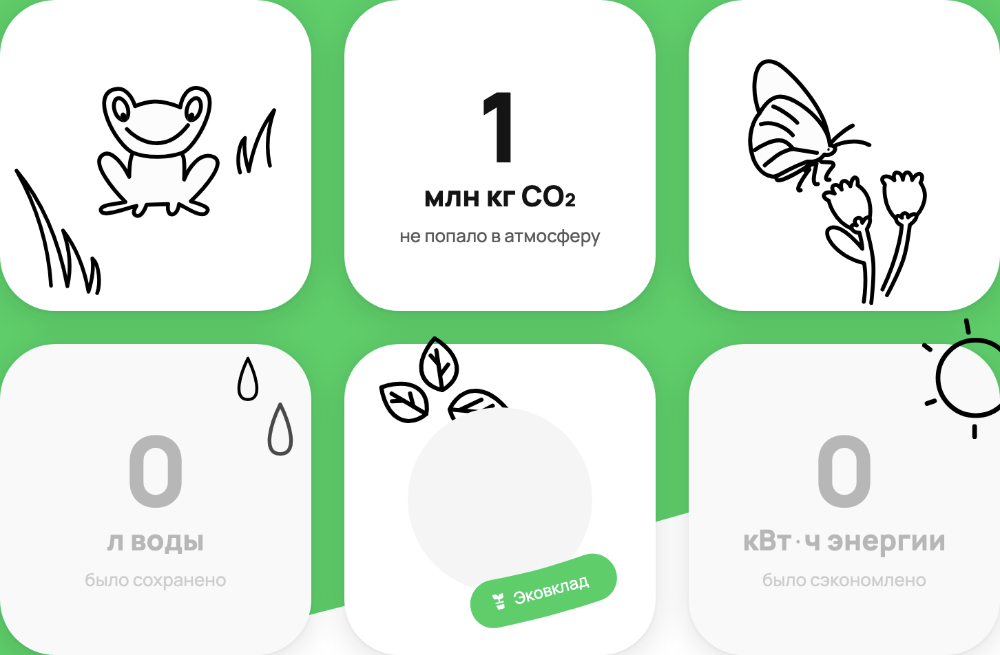

___
**ID**: BR5

**Заголовок**:

В поле Co2 некорректно конвертируется значение 1000001 кг

**Окружение**:

ОС: Windows 10 64-bit
Браузер: Google Chrome 120.0.6099.109, разрешение 1920х1080

**Приоритет**

Низкий

**Шаги**:

Открыть DevTools

Включить перезапись запросов: Sources/Overrides, чек-бокс Enable Local Overrides

Настроить перезапись ответа от роута `/web/1/charity/ecoImpact/init`
на body

`{"result":{"blocks":{"personalImpact":{"data":{"co2":1000001,"energy":0,"water":0,"materials":0,"pineYears":0}}},"isAuthorized":true},"status":"ok"}`

Открываем страницу https://www.avito.ru/avito-care/eco-impact

**Ожидаемый результат**:

Верстка отображается корректно
В блоке Co2 отображается 1 тыс тонн

**Фактический результат**:

___
**ID**: BR6

**Заголовок**:

В поле Co2 некорректно конвертируется значение 550000000 кг

**Окружение**:

ОС: Windows 10 64-bit
Браузер: Google Chrome 120.0.6099.109, разрешение 1920х1080

**Приоритет**

Низкий

**Шаги**:

Открыть DevTools

Включить перезапись запросов: Sources/Overrides, чек-бокс Enable Local Overrides

Настроить перезапись ответа от роута `/web/1/charity/ecoImpact/init`
на body

`{"result":{"blocks":{"personalImpact":{"data":{"co2":550000000,"energy":0,"water":0,"materials":0,"pineYears":0}}},"isAuthorized":true},"status":"ok"}`

Открываем страницу https://www.avito.ru/avito-care/eco-impact

**Ожидаемый результат**:

Верстка отображается корректно
В блоке Co2 отображается 550 тыс тонн

**Фактический результат**:

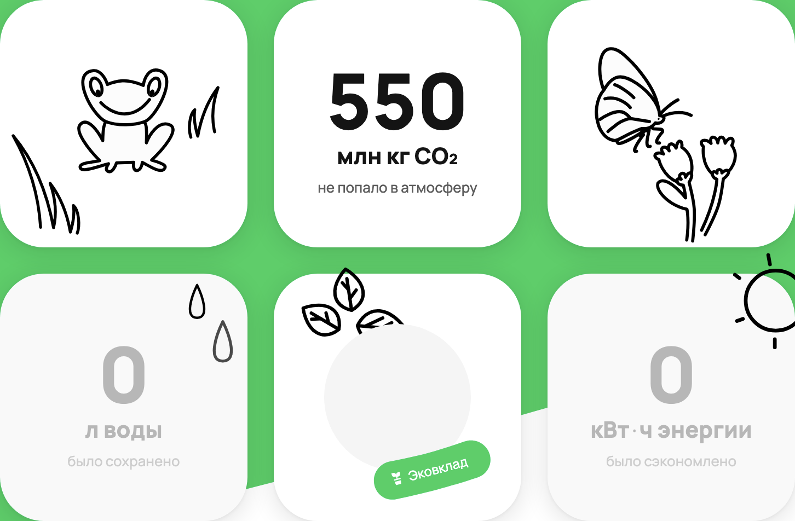

___
**ID**: BR7

**Заголовок**:

В поле Co2 некорректно конвертируется значение 999999998 кг

**Окружение**:

ОС: Windows 10 64-bit
Браузер: Google Chrome 120.0.6099.109, разрешение 1920х1080

**Приоритет**

Низкий

**Шаги**:

Открыть DevTools

Включить перезапись запросов: Sources/Overrides, чек-бокс Enable Local Overrides

Настроить перезапись ответа от роута `/web/1/charity/ecoImpact/init`
на body

`{"result":{"blocks":{"personalImpact":{"data":{"co2":999999998,"energy":0,"water":0,"materials":0,"pineYears":0}}},"isAuthorized":true},"status":"ok"}`

Открываем страницу https://www.avito.ru/avito-care/eco-impact

**Ожидаемый результат**:

Верстка отображается корректно
В блоке Co2 отображается 1000 тыс тонн

**Фактический результат**:

___
**ID**: BR8

**Заголовок**:

В поле Co2 некорректно конвертируется значение 999999999 кг

**Окружение**:

ОС: Windows 10 64-bit
Браузер: Google Chrome 120.0.6099.109, разрешение 1920х1080

**Приоритет**

Низкий

**Шаги**:

Открыть DevTools

Включить перезапись запросов: Sources/Overrides, чек-бокс Enable Local Overrides

Настроить перезапись ответа от роута `/web/1/charity/ecoImpact/init`
на body

`{"result":{"blocks":{"personalImpact":{"data":{"co2":999999999,"energy":0,"water":0,"materials":0,"pineYears":0}}},"isAuthorized":true},"status":"ok"}`

Открываем страницу https://www.avito.ru/avito-care/eco-impact

**Ожидаемый результат**:

Верстка отображается корректно
В блоке Co2 отображается 1000 тыс тонн

**Фактический результат**:

___
**ID**: BR9

**Заголовок**:

В поле Co2 при конвертации значения 1000000000000000 кг теряется префикс

**Окружение**:

ОС: Windows 10 64-bit
Браузер: Google Chrome 120.0.6099.109, разрешение 1920х1080

**Приоритет**

Средний

**Шаги**:

Открыть DevTools

Включить перезапись запросов: Sources/Overrides, чек-бокс Enable Local Overrides

Настроить перезапись ответа от роута `/web/1/charity/ecoImpact/init`
на body

`{"result":{"blocks":{"personalImpact":{"data":{"co2":1000000000000000,"energy":0,"water":0,"materials":0,"pineYears":0}}},"isAuthorized":true},"status":"ok"}`

Открываем страницу https://www.avito.ru/avito-care/eco-impact

**Ожидаемый результат**:

Верстка отображается корректно
В блоке Co2 отображается 1 трлн тонн

**Фактический результат**:

___
**ID**: BR10

**Заголовок**:

В поле Co2 при конвертации значения 1000000000000001 кг теряется префикс

**Окружение**:

ОС: Windows 10 64-bit
Браузер: Google Chrome 120.0.6099.109, разрешение 1920х1080

**Приоритет**

Средний

**Шаги**:

Открыть DevTools

Включить перезапись запросов: Sources/Overrides, чек-бокс Enable Local Overrides

Настроить перезапись ответа от роута `/web/1/charity/ecoImpact/init`
на body

`{"result":{"blocks":{"personalImpact":{"data":{"co2":1000000000000001,"energy":0,"water":0,"materials":0,"pineYears":0}}},"isAuthorized":true},"status":"ok"}`

Открываем страницу https://www.avito.ru/avito-care/eco-impact

**Ожидаемый результат**:

Верстка отображается корректно
В блоке Co2 отображается 1 трлн тонн

**Фактический результат**:

___
**ID**: BR11

**Заголовок**:

В поле Co2 отображается число 576 строкой

**Окружение**:

ОС: Windows 10 64-bit
Браузер: Google Chrome 120.0.6099.109, разрешение 1920х1080

**Приоритет**

Средний

**Шаги**:

Открыть DevTools

Включить перезапись запросов: Sources/Overrides, чек-бокс Enable Local Overrides

Настроить перезапись ответа от роута `/web/1/charity/ecoImpact/init`
на body

`{"result":{"blocks":{"personalImpact":{"data":{"co2":"576","energy":0,"water":0,"materials":0,"pineYears":0}}},"isAuthorized":true},"status":"ok"}`

Открываем страницу https://www.avito.ru/avito-care/eco-impact

**Ожидаемый результат**:

Верстка отображается корректно
В блоке Co2 отображается 0 кг

**Фактический результат**:

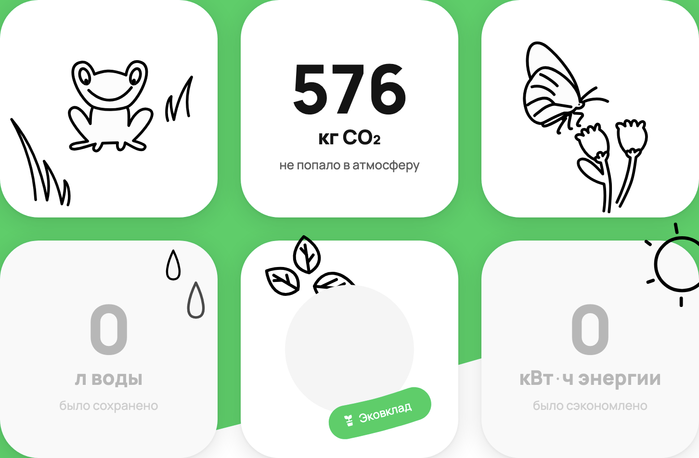

___
**ID**: BR12

**Заголовок**:

В поле Co2 спецсимвол @ отображается как NaN

**Окружение**:

ОС: Windows 10 64-bit
Браузер: Google Chrome 120.0.6099.109, разрешение 1920х1080

**Приоритет**

Средний

**Шаги**:

Открыть DevTools

Включить перезапись запросов: Sources/Overrides, чек-бокс Enable Local Overrides

Настроить перезапись ответа от роута `/web/1/charity/ecoImpact/init`
на body

`{"result":{"blocks":{"personalImpact":{"data":{"co2":"@","energy":0,"water":0,"materials":0,"pineYears":0}}},"isAuthorized":true},"status":"ok"}`

Открываем страницу https://www.avito.ru/avito-care/eco-impact

**Ожидаемый результат**:

Верстка отображается корректно
В блоке Co2 отображается 0 кг

**Фактический результат**:

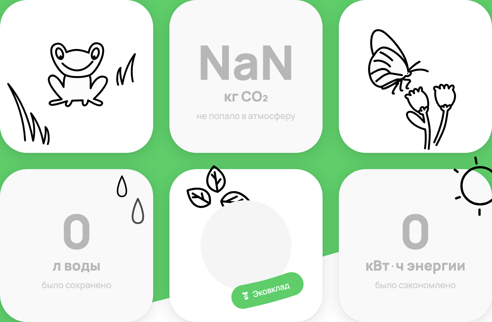

___
**ID**: BR13

**Заголовок**:

В поле Co2 строка abc отображается как NaN

**Окружение**:

ОС: Windows 10 64-bit
Браузер: Google Chrome 120.0.6099.109, разрешение 1920х1080

**Приоритет**

Средний

**Шаги**:

Открыть DevTools

Включить перезапись запросов: Sources/Overrides, чек-бокс Enable Local Overrides

Настроить перезапись ответа от роута `/web/1/charity/ecoImpact/init`
на body

`{"result":{"blocks":{"personalImpact":{"data":{"co2":"abc","energy":0,"water":0,"materials":0,"pineYears":0}}},"isAuthorized":true},"status":"ok"}`

Открываем страницу https://www.avito.ru/avito-care/eco-impact

**Ожидаемый результат**:

Верстка отображается корректно
В блоке Co2 отображается 0 кг

**Фактический результат**:

___
**ID**: BR14

**Заголовок**:

В поле Water отображается отрицательное значение -500 л

**Окружение**:

ОС: Windows 10 64-bit
Браузер: Google Chrome 120.0.6099.109, разрешение 1920х1080

**Приоритет**

Средний

**Шаги**:

Открыть DevTools

Включить перезапись запросов: Sources/Overrides, чек-бокс Enable Local Overrides

Настроить перезапись ответа от роута `/web/1/charity/ecoImpact/init`
на body

`{"result":{"blocks":{"personalImpact":{"data":{"co2":0,"energy":0,"water":-500,"materials":0,"pineYears":0}}},"isAuthorized":true},"status":"ok"}`

Открываем страницу https://www.avito.ru/avito-care/eco-impact

**Ожидаемый результат**:

Верстка отображается корректно
В блоке Water отображается 0 л

**Фактический результат**:

___
**ID**: BR15

**Заголовок**:

В поле Water отображается отрицательное значение -2 л

**Окружение**:

ОС: Windows 10 64-bit
Браузер: Google Chrome 120.0.6099.109, разрешение 1920х1080

**Приоритет**

Средний

**Шаги**:

Открыть DevTools

Включить перезапись запросов: Sources/Overrides, чек-бокс Enable Local Overrides

Настроить перезапись ответа от роута `/web/1/charity/ecoImpact/init`
на body

`{"result":{"blocks":{"personalImpact":{"data":{"co2":0,"energy":0,"water":-2,"materials":0,"pineYears":0}}},"isAuthorized":true},"status":"ok"}`

Открываем страницу https://www.avito.ru/avito-care/eco-impact

**Ожидаемый результат**:

Верстка отображается корректно
В блоке Water отображается 0 л

**Фактический результат**:

___
**ID**: BR16

**Заголовок**:

В поле Water отображается отрицательное значение -1 л

**Окружение**:

ОС: Windows 10 64-bit
Браузер: Google Chrome 120.0.6099.109, разрешение 1920х1080

**Приоритет**

Средний

**Шаги**:

Открыть DevTools

Включить перезапись запросов: Sources/Overrides, чек-бокс Enable Local Overrides

Настроить перезапись ответа от роута `/web/1/charity/ecoImpact/init`
на body

`{"result":{"blocks":{"personalImpact":{"data":{"co2":0,"energy":0,"water":-1,"materials":0,"pineYears":0}}},"isAuthorized":true},"status":"ok"}`

Открываем страницу https://www.avito.ru/avito-care/eco-impact

**Ожидаемый результат**:

Верстка отображается корректно
В блоке Water отображается 0 л

**Фактический результат**:

___
**ID**: BR17

**Заголовок**:

В поле Water при конвертации значения 1000000000000000 л теряется префикс

**Окружение**:

ОС: Windows 10 64-bit
Браузер: Google Chrome 120.0.6099.109, разрешение 1920х1080

**Приоритет**

Средний

**Шаги**:

Открыть DevTools

Включить перезапись запросов: Sources/Overrides, чек-бокс Enable Local Overrides

Настроить перезапись ответа от роута `/web/1/charity/ecoImpact/init`
на body

`{"result":{"blocks":{"personalImpact":{"data":{"co2":0,"energy":0,"water":1000000000000000,"materials":0,"pineYears":0}}},"isAuthorized":true},"status":"ok"}`

Открываем страницу https://www.avito.ru/avito-care/eco-impact

**Ожидаемый результат**:

Верстка отображается корректно
В блоке Water отображается 1 трлн м³

**Фактический результат**:

___
**ID**: BR18

**Заголовок**:

В поле Water при конвертации значения 1000000000000001 л теряется префикс

**Окружение**:

ОС: Windows 10 64-bit
Браузер: Google Chrome 120.0.6099.109, разрешение 1920х1080

**Приоритет**

Средний

**Шаги**:

Открыть DevTools

Включить перезапись запросов: Sources/Overrides, чек-бокс Enable Local Overrides

Настроить перезапись ответа от роута `/web/1/charity/ecoImpact/init`
на body

`{"result":{"blocks":{"personalImpact":{"data":{"co2":0,"energy":0,"water":1000000000000001,"materials":0,"pineYears":0}}},"isAuthorized":true},"status":"ok"}`

Открываем страницу https://www.avito.ru/avito-care/eco-impact

**Ожидаемый результат**:

Верстка отображается корректно
В блоке Water отображается 1 трлн м³

**Фактический результат**:

___
**ID**: BR19

**Заголовок**:

В поле Water отображается число 576 строкой

**Окружение**:

ОС: Windows 10 64-bit
Браузер: Google Chrome 120.0.6099.109, разрешение 1920х1080

**Приоритет**

Средний

**Шаги**:

Открыть DevTools

Включить перезапись запросов: Sources/Overrides, чек-бокс Enable Local Overrides

Настроить перезапись ответа от роута `/web/1/charity/ecoImpact/init`
на body

`{"result":{"blocks":{"personalImpact":{"data":{"co2":0,"energy":0,"water":"576","materials":0,"pineYears":0}}},"isAuthorized":true},"status":"ok"}`

Открываем страницу https://www.avito.ru/avito-care/eco-impact

**Ожидаемый результат**:

Верстка отображается корректно
В блоке Water отображается 0 л

**Фактический результат**:

___
**ID**: BR20

**Заголовок**:

В поле Water спецсимвол @ отображается как NaN

**Окружение**:

ОС: Windows 10 64-bit
Браузер: Google Chrome 120.0.6099.109, разрешение 1920х1080

**Приоритет**

Средний

**Шаги**:

Открыть DevTools

Включить перезапись запросов: Sources/Overrides, чек-бокс Enable Local Overrides

Настроить перезапись ответа от роута `/web/1/charity/ecoImpact/init`
на body

`{"result":{"blocks":{"personalImpact":{"data":{"co2":0,"energy":0,"water":"@","materials":0,"pineYears":0}}},"isAuthorized":true},"status":"ok"}`

Открываем страницу https://www.avito.ru/avito-care/eco-impact

**Ожидаемый результат**:

Верстка отображается корректно
В блоке Water отображается 0 л

**Фактический результат**:

___
**ID**: BR21

**Заголовок**:

В поле Water строка abc отображается как NaN

**Окружение**:

ОС: Windows 10 64-bit
Браузер: Google Chrome 120.0.6099.109, разрешение 1920х1080

**Приоритет**

Средний

**Шаги**:

Открыть DevTools

Включить перезапись запросов: Sources/Overrides, чек-бокс Enable Local Overrides

Настроить перезапись ответа от роута `/web/1/charity/ecoImpact/init`
на body

`{"result":{"blocks":{"personalImpact":{"data":{"co2":0,"energy":0,"water":"abc","materials":0,"pineYears":0}}},"isAuthorized":true},"status":"ok"}`

Открываем страницу https://www.avito.ru/avito-care/eco-impact

**Ожидаемый результат**:

Верстка отображается корректно
В блоке Water отображается 0 л

**Фактический результат**:

___
**ID**: BR22

**Заголовок**:

В поле Energy отображается отрицательное значение -500 кВт*ч

**Окружение**:

ОС: Windows 10 64-bit
Браузер: Google Chrome 120.0.6099.109, разрешение 1920х1080

**Приоритет**

Средний

**Шаги**:

Открыть DevTools

Включить перезапись запросов: Sources/Overrides, чек-бокс Enable Local Overrides

Настроить перезапись ответа от роута `/web/1/charity/ecoImpact/init`
на body

`{"result":{"blocks":{"personalImpact":{"data":{"co2":0,"energy":-500,"water":0,"materials":0,"pineYears":0}}},"isAuthorized":true},"status":"ok"}`

Открываем страницу https://www.avito.ru/avito-care/eco-impact

**Ожидаемый результат**:

Верстка отображается корректно
В блоке Energy отображается 0 кВт*ч

**Фактический результат**:

___
**ID**: BR23

**Заголовок**:

В поле Energy отображается отрицательное значение -2 кВт*ч

**Окружение**:

ОС: Windows 10 64-bit
Браузер: Google Chrome 120.0.6099.109, разрешение 1920х1080

**Приоритет**

Средний

**Шаги**:

Открыть DevTools

Включить перезапись запросов: Sources/Overrides, чек-бокс Enable Local Overrides

Настроить перезапись ответа от роута `/web/1/charity/ecoImpact/init`
на body

`{"result":{"blocks":{"personalImpact":{"data":{"co2":0,"energy":-2,"water":0,"materials":0,"pineYears":0}}},"isAuthorized":true},"status":"ok"}`

Открываем страницу https://www.avito.ru/avito-care/eco-impact

**Ожидаемый результат**:

Верстка отображается корректно
В блоке Energy отображается 0 кВт*ч

**Фактический результат**:

___
**ID**: BR24

**Заголовок**:

В поле Energy отображается отрицательное значение -1 кВт*ч

**Окружение**:

ОС: Windows 10 64-bit
Браузер: Google Chrome 120.0.6099.109, разрешение 1920х1080

**Приоритет**

Средний

**Шаги**:

Открыть DevTools

Включить перезапись запросов: Sources/Overrides, чек-бокс Enable Local Overrides

Настроить перезапись ответа от роута `/web/1/charity/ecoImpact/init`
на body

`{"result":{"blocks":{"personalImpact":{"data":{"co2":0,"energy":-1,"water":0,"materials":0,"pineYears":0}}},"isAuthorized":true},"status":"ok"}`

Открываем страницу https://www.avito.ru/avito-care/eco-impact

**Ожидаемый результат**:

Верстка отображается корректно
В блоке Energy отображается 0 кВт*ч

**Фактический результат**:

___
**ID**: BR25

**Заголовок**:

В поле Energy некорректно конвертируется значение 1000000 кВт*ч

**Окружение**:

ОС: Windows 10 64-bit
Браузер: Google Chrome 120.0.6099.109, разрешение 1920х1080

**Приоритет**

Низкий

**Шаги**:

Открыть DevTools

Включить перезапись запросов: Sources/Overrides, чек-бокс Enable Local Overrides

Настроить перезапись ответа от роута `/web/1/charity/ecoImpact/init`
на body

`{"result":{"blocks":{"personalImpact":{"data":{"co2":0,"energy":1000000,"water":0,"materials":0,"pineYears":0}}},"isAuthorized":true},"status":"ok"}`

Открываем страницу https://www.avito.ru/avito-care/eco-impact

**Ожидаемый результат**:

Верстка отображается корректно
В блоке Energy отображается 1 тыс МВт*ч

**Фактический результат**:

___
**ID**: BR26

**Заголовок**:

В поле Energy при конвертации 1000000 кВт*ч некорректно отображается вёрстка

**Окружение**:

ОС: Windows 10 64-bit
Браузер: Google Chrome 120.0.6099.109, разрешение 1920х1080

**Приоритет**

Незначительный

**Шаги**:

Открыть DevTools

Включить перезапись запросов: Sources/Overrides, чек-бокс Enable Local Overrides

Настроить перезапись ответа от роута `/web/1/charity/ecoImpact/init`
на body

`{"result":{"blocks":{"personalImpact":{"data":{"co2":0,"energy":1000000,"water":0,"materials":0,"pineYears":0}}},"isAuthorized":true},"status":"ok"}`

Открываем страницу https://www.avito.ru/avito-care/eco-impact

**Ожидаемый результат**:

Верстка отображается корректно
В блоке Energy отображается 1 тыс МВт*ч

**Фактический результат**:

___
**ID**: BR27

**Заголовок**:

В поле Energy некорректно конвертируется значение 1000001 кВт*ч

**Окружение**:

ОС: Windows 10 64-bit
Браузер: Google Chrome 120.0.6099.109, разрешение 1920х1080

**Приоритет**

Низкий

**Шаги**:

Открыть DevTools

Включить перезапись запросов: Sources/Overrides, чек-бокс Enable Local Overrides

Настроить перезапись ответа от роута `/web/1/charity/ecoImpact/init`
на body

`{"result":{"blocks":{"personalImpact":{"data":{"co2":0,"energy":1000001,"water":0,"materials":0,"pineYears":0}}},"isAuthorized":true},"status":"ok"}`

Открываем страницу https://www.avito.ru/avito-care/eco-impact

**Ожидаемый результат**:

Верстка отображается корректно
В блоке Energy отображается 1 тыс МВт*ч

**Фактический результат**:

___
**ID**: BR28

**Заголовок**:

В поле Energy при конвертации 1000001 кВт*ч некорректно отображается вёрстка

**Окружение**:

ОС: Windows 10 64-bit
Браузер: Google Chrome 120.0.6099.109, разрешение 1920х1080

**Приоритет**

Незначительный

**Шаги**:

Открыть DevTools

Включить перезапись запросов: Sources/Overrides, чек-бокс Enable Local Overrides

Настроить перезапись ответа от роута `/web/1/charity/ecoImpact/init`
на body

`{"result":{"blocks":{"personalImpact":{"data":{"co2":0,"energy":1000001,"water":0,"materials":0,"pineYears":0}}},"isAuthorized":true},"status":"ok"}`

Открываем страницу https://www.avito.ru/avito-care/eco-impact

**Ожидаемый результат**:

Верстка отображается корректно
В блоке Energy отображается 1 тыс МВт*ч

**Фактический результат**:

___
**ID**: BR29

**Заголовок**:

В поле Energy некорректно конвертируется значение 550000000 кВт*ч

**Окружение**:

ОС: Windows 10 64-bit
Браузер: Google Chrome 120.0.6099.109, разрешение 1920х1080

**Приоритет**

Низкий

**Шаги**:

Открыть DevTools

Включить перезапись запросов: Sources/Overrides, чек-бокс Enable Local Overrides

Настроить перезапись ответа от роута `/web/1/charity/ecoImpact/init`
на body

`{"result":{"blocks":{"personalImpact":{"data":{"co2":0,"energy":550000000,"water":0,"materials":0,"pineYears":0}}},"isAuthorized":true},"status":"ok"}`

Открываем страницу https://www.avito.ru/avito-care/eco-impact

**Ожидаемый результат**:

Верстка отображается корректно
В блоке Energy отображается 550 тыс МВт*ч

**Фактический результат**:

___
**ID**: BR30

**Заголовок**:

В поле Energy при конвертации 550000000 кВт*ч некорректно отображается вёрстка

**Окружение**:

ОС: Windows 10 64-bit
Браузер: Google Chrome 120.0.6099.109, разрешение 1920х1080

**Приоритет**

Незначительный

**Шаги**:

Открыть DevTools

Включить перезапись запросов: Sources/Overrides, чек-бокс Enable Local Overrides

Настроить перезапись ответа от роута `/web/1/charity/ecoImpact/init`
на body

`{"result":{"blocks":{"personalImpact":{"data":{"co2":0,"energy":550000000,"water":0,"materials":0,"pineYears":0}}},"isAuthorized":true},"status":"ok"}`

Открываем страницу https://www.avito.ru/avito-care/eco-impact

**Ожидаемый результат**:

Верстка отображается корректно
В блоке Energy отображается 550 тыс МВт*ч

**Фактический результат**:

___
**ID**: BR31

**Заголовок**:

В поле Energy некорректно конвертируется значение 999999998 кВт*ч

**Окружение**:

ОС: Windows 10 64-bit
Браузер: Google Chrome 120.0.6099.109, разрешение 1920х1080

**Приоритет**

Низкий

**Шаги**:

Открыть DevTools

Включить перезапись запросов: Sources/Overrides, чек-бокс Enable Local Overrides

Настроить перезапись ответа от роута `/web/1/charity/ecoImpact/init`
на body

`{"result":{"blocks":{"personalImpact":{"data":{"co2":0,"energy":999999998,"water":0,"materials":0,"pineYears":0}}},"isAuthorized":true},"status":"ok"}`

Открываем страницу https://www.avito.ru/avito-care/eco-impact

**Ожидаемый результат**:

Верстка отображается корректно
В блоке Energy отображается 1000 тыс МВт*ч

**Фактический результат**:

___
**ID**: BR32

**Заголовок**:

В поле Energy при конвертации 999999998 кВт*ч некорректно отображается вёрстка

**Окружение**:

ОС: Windows 10 64-bit
Браузер: Google Chrome 120.0.6099.109, разрешение 1920х1080

**Приоритет**

Незначительный

**Шаги**:

Открыть DevTools

Включить перезапись запросов: Sources/Overrides, чек-бокс Enable Local Overrides

Настроить перезапись ответа от роута `/web/1/charity/ecoImpact/init`
на body

`{"result":{"blocks":{"personalImpact":{"data":{"co2":0,"energy":999999998,"water":0,"materials":0,"pineYears":0}}},"isAuthorized":true},"status":"ok"}`

Открываем страницу https://www.avito.ru/avito-care/eco-impact

**Ожидаемый результат**:

Верстка отображается корректно
В блоке Energy отображается 1000 тыс МВт*ч

**Фактический результат**:

___
**ID**: BR33

**Заголовок**:

В поле Energy некорректно конвертируется значение 999999999 кВт*ч

**Окружение**:

ОС: Windows 10 64-bit
Браузер: Google Chrome 120.0.6099.109, разрешение 1920х1080

**Приоритет**

Низкий

**Шаги**:

Открыть DevTools

Включить перезапись запросов: Sources/Overrides, чек-бокс Enable Local Overrides

Настроить перезапись ответа от роута `/web/1/charity/ecoImpact/init`
на body

`{"result":{"blocks":{"personalImpact":{"data":{"co2":0,"energy":999999999,"water":0,"materials":0,"pineYears":0}}},"isAuthorized":true},"status":"ok"}`

Открываем страницу https://www.avito.ru/avito-care/eco-impact

**Ожидаемый результат**:

Верстка отображается корректно
В блоке Energy отображается 1000 тыс МВт*ч

**Фактический результат**:

___
**ID**: BR34

**Заголовок**:

В поле Energy при конвертации 999999999 кВт*ч некорректно отображается вёрстка

**Окружение**:

ОС: Windows 10 64-bit
Браузер: Google Chrome 120.0.6099.109, разрешение 1920х1080

**Приоритет**

Незначительный

**Шаги**:

Открыть DevTools

Включить перезапись запросов: Sources/Overrides, чек-бокс Enable Local Overrides

Настроить перезапись ответа от роута `/web/1/charity/ecoImpact/init`
на body

`{"result":{"blocks":{"personalImpact":{"data":{"co2":0,"energy":999999999,"water":0,"materials":0,"pineYears":0}}},"isAuthorized":true},"status":"ok"}`

Открываем страницу https://www.avito.ru/avito-care/eco-impact

**Ожидаемый результат**:

Верстка отображается корректно
В блоке Energy отображается 1000 тыс МВт*ч

**Фактический результат**:

___
**ID**: BR35

**Заголовок**:

В поле Energy при конвертации 1000000000 кВт*ч некорректно отображается вёрстка

**Окружение**:

ОС: Windows 10 64-bit
Браузер: Google Chrome 120.0.6099.109, разрешение 1920х1080

**Приоритет**

Незначительный

**Шаги**:

Открыть DevTools

Включить перезапись запросов: Sources/Overrides, чек-бокс Enable Local Overrides

Настроить перезапись ответа от роута `/web/1/charity/ecoImpact/init`
на body

`{"result":{"blocks":{"personalImpact":{"data":{"co2":0,"energy":1000000000,"water":0,"materials":0,"pineYears":0}}},"isAuthorized":true},"status":"ok"}`

Открываем страницу https://www.avito.ru/avito-care/eco-impact

**Ожидаемый результат**:

Верстка отображается корректно
В блоке Energy отображается 1 млн МВт*ч

**Фактический результат**:

___
**ID**: BR36

**Заголовок**:

В поле Energy при конвертации 1000000001 кВт*ч некорректно отображается вёрстка

**Окружение**:

ОС: Windows 10 64-bit
Браузер: Google Chrome 120.0.6099.109, разрешение 1920х1080

**Приоритет**

Незначительный

**Шаги**:

Открыть DevTools

Включить перезапись запросов: Sources/Overrides, чек-бокс Enable Local Overrides

Настроить перезапись ответа от роута `/web/1/charity/ecoImpact/init`
на body

`{"result":{"blocks":{"personalImpact":{"data":{"co2":0,"energy":1000000001,"water":0,"materials":0,"pineYears":0}}},"isAuthorized":true},"status":"ok"}`

Открываем страницу https://www.avito.ru/avito-care/eco-impact

**Ожидаемый результат**:

Верстка отображается корректно
В блоке Energy отображается 1 млн МВт*ч

**Фактический результат**:

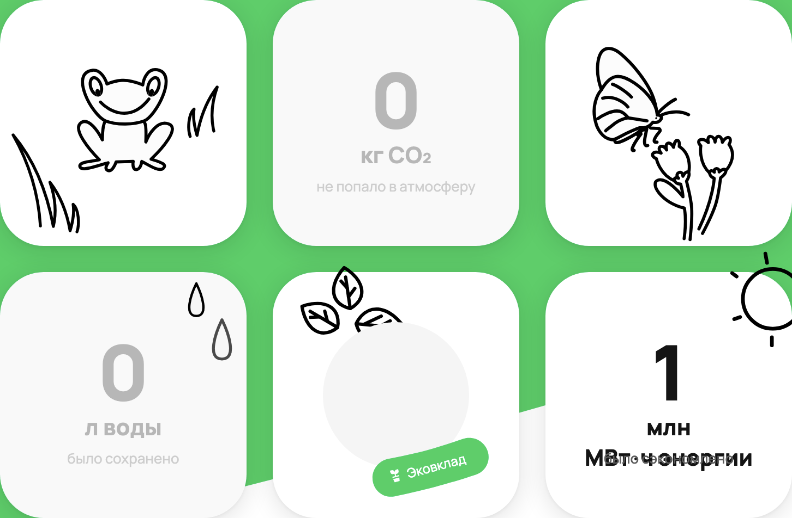

___
**ID**: BR37

**Заголовок**:

В поле Energy при конвертации 550000000000 кВт*ч некорректно отображается вёрстка

**Окружение**:

ОС: Windows 10 64-bit
Браузер: Google Chrome 120.0.6099.109, разрешение 1920х1080

**Приоритет**

Незначительный

**Шаги**:

Открыть DevTools

Включить перезапись запросов: Sources/Overrides, чек-бокс Enable Local Overrides

Настроить перезапись ответа от роута `/web/1/charity/ecoImpact/init`
на body

`{"result":{"blocks":{"personalImpact":{"data":{"co2":0,"energy":550000000000,"water":0,"materials":0,"pineYears":0}}},"isAuthorized":true},"status":"ok"}`

Открываем страницу https://www.avito.ru/avito-care/eco-impact

**Ожидаемый результат**:

Верстка отображается корректно
В блоке Energy отображается 550 млн МВт*ч

**Фактический результат**:

___
**ID**: BR38

**Заголовок**:

В поле Energy при конвертации 999999999998 кВт*ч некорректно отображается вёрстка

**Окружение**:

ОС: Windows 10 64-bit
Браузер: Google Chrome 120.0.6099.109, разрешение 1920х1080

**Приоритет**

Незначительный

**Шаги**:

Открыть DevTools

Включить перезапись запросов: Sources/Overrides, чек-бокс Enable Local Overrides

Настроить перезапись ответа от роута `/web/1/charity/ecoImpact/init`
на body

`{"result":{"blocks":{"personalImpact":{"data":{"co2":0,"energy":999999999998,"water":0,"materials":0,"pineYears":0}}},"isAuthorized":true},"status":"ok"}`

Открываем страницу https://www.avito.ru/avito-care/eco-impact

**Ожидаемый результат**:

Верстка отображается корректно
В блоке Energy отображается 1000 млн МВт*ч

**Фактический результат**:

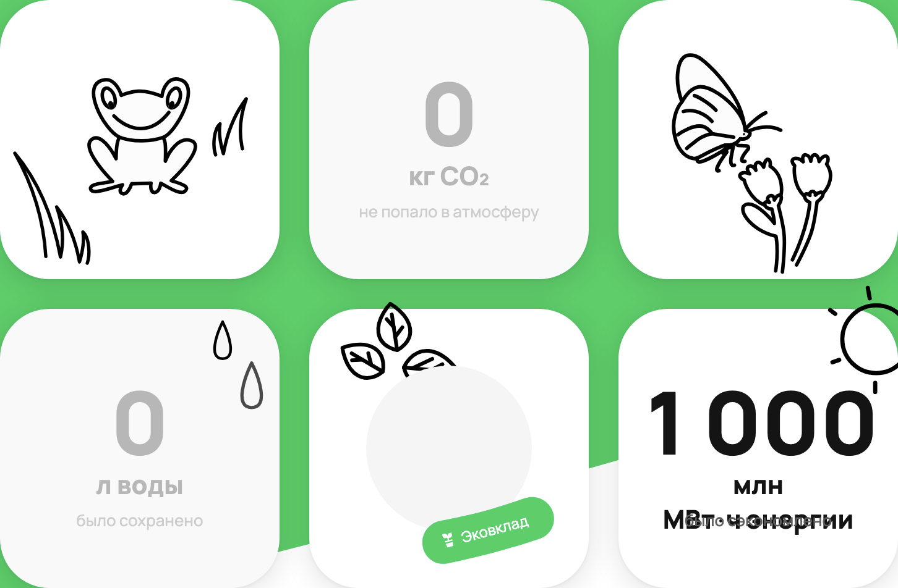

___
**ID**: BR39

**Заголовок**:

В поле Energy при конвертации 999999999999 кВт*ч некорректно отображается вёрстка

**Окружение**:

ОС: Windows 10 64-bit
Браузер: Google Chrome 120.0.6099.109, разрешение 1920х1080

**Приоритет**

Незначительный

**Шаги**:

Открыть DevTools

Включить перезапись запросов: Sources/Overrides, чек-бокс Enable Local Overrides

Настроить перезапись ответа от роута `/web/1/charity/ecoImpact/init`
на body

`{"result":{"blocks":{"personalImpact":{"data":{"co2":0,"energy":999999999999,"water":0,"materials":0,"pineYears":0}}},"isAuthorized":true},"status":"ok"}`

Открываем страницу https://www.avito.ru/avito-care/eco-impact

**Ожидаемый результат**:

Верстка отображается корректно
В блоке Energy отображается 1000 млн МВт*ч

**Фактический результат**:

___
**ID**: BR40

**Заголовок**:

В поле Energy при конвертации 1000000000000 кВт*ч некорректно отображается вёрстка

**Окружение**:

ОС: Windows 10 64-bit
Браузер: Google Chrome 120.0.6099.109, разрешение 1920х1080

**Приоритет**

Незначительный

**Шаги**:

Открыть DevTools

Включить перезапись запросов: Sources/Overrides, чек-бокс Enable Local Overrides

Настроить перезапись ответа от роута `/web/1/charity/ecoImpact/init`
на body

`{"result":{"blocks":{"personalImpact":{"data":{"co2":0,"energy":1000000000000,"water":0,"materials":0,"pineYears":0}}},"isAuthorized":true},"status":"ok"}`

Открываем страницу https://www.avito.ru/avito-care/eco-impact

**Ожидаемый результат**:

Верстка отображается корректно
В блоке Energy отображается 1 млрд МВт*ч

**Фактический результат**:

___
**ID**: BR41

**Заголовок**:

В поле Energy при конвертации 1000000000001 кВт*ч некорректно отображается вёрстка

**Окружение**:

ОС: Windows 10 64-bit
Браузер: Google Chrome 120.0.6099.109, разрешение 1920х1080

**Приоритет**

Незначительный

**Шаги**:

Открыть DevTools

Включить перезапись запросов: Sources/Overrides, чек-бокс Enable Local Overrides

Настроить перезапись ответа от роута `/web/1/charity/ecoImpact/init`
на body

`{"result":{"blocks":{"personalImpact":{"data":{"co2":0,"energy":1000000000001,"water":0,"materials":0,"pineYears":0}}},"isAuthorized":true},"status":"ok"}`

Открываем страницу https://www.avito.ru/avito-care/eco-impact

**Ожидаемый результат**:

Верстка отображается корректно
В блоке Energy отображается 1 млрд МВт*ч

**Фактический результат**:

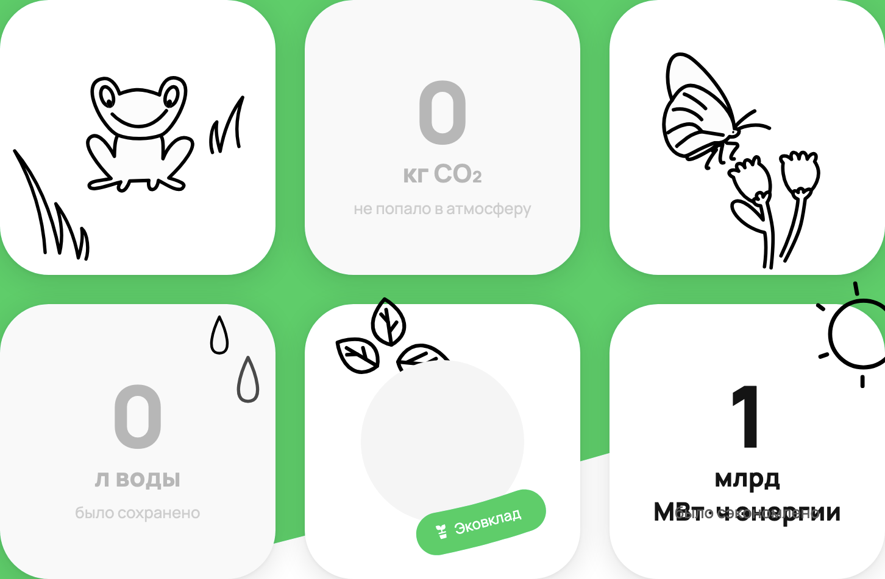

___
**ID**: BR42

**Заголовок**:

В поле Energy при конвертации 550000000000000 кВт*ч некорректно отображается вёрстка

**Окружение**:

ОС: Windows 10 64-bit
Браузер: Google Chrome 120.0.6099.109, разрешение 1920х1080

**Приоритет**

Незначительный

**Шаги**:

Открыть DevTools

Включить перезапись запросов: Sources/Overrides, чек-бокс Enable Local Overrides

Настроить перезапись ответа от роута `/web/1/charity/ecoImpact/init`
на body

`{"result":{"blocks":{"personalImpact":{"data":{"co2":0,"energy":550000000000000,"water":0,"materials":0,"pineYears":0}}},"isAuthorized":true},"status":"ok"}`

Открываем страницу https://www.avito.ru/avito-care/eco-impact

**Ожидаемый результат**:

Верстка отображается корректно
В блоке Energy отображается 550 млрд МВт*ч

**Фактический результат**:

___
**ID**: BR43

**Заголовок**:

В поле Energy при конвертации 999999999999998 кВт*ч некорректно отображается вёрстка

**Окружение**:

ОС: Windows 10 64-bit
Браузер: Google Chrome 120.0.6099.109, разрешение 1920х1080

**Приоритет**

Незначительный

**Шаги**:

Открыть DevTools

Включить перезапись запросов: Sources/Overrides, чек-бокс Enable Local Overrides

Настроить перезапись ответа от роута `/web/1/charity/ecoImpact/init`
на body

`{"result":{"blocks":{"personalImpact":{"data":{"co2":0,"energy":999999999999998,"water":0,"materials":0,"pineYears":0}}},"isAuthorized":true},"status":"ok"}`

Открываем страницу https://www.avito.ru/avito-care/eco-impact

**Ожидаемый результат**:

Верстка отображается корректно
В блоке Energy отображается 1000 млрд МВт*ч

**Фактический результат**:

___
**ID**: BR44

**Заголовок**:

В поле Energy при конвертации 999999999999999 кВт*ч некорректно отображается вёрстка

**Окружение**:

ОС: Windows 10 64-bit
Браузер: Google Chrome 120.0.6099.109, разрешение 1920х1080

**Приоритет**

Незначительный

**Шаги**:

Открыть DevTools

Включить перезапись запросов: Sources/Overrides, чек-бокс Enable Local Overrides

Настроить перезапись ответа от роута `/web/1/charity/ecoImpact/init`
на body

`{"result":{"blocks":{"personalImpact":{"data":{"co2":0,"energy":999999999999999,"water":0,"materials":0,"pineYears":0}}},"isAuthorized":true},"status":"ok"}`

Открываем страницу https://www.avito.ru/avito-care/eco-impact

**Ожидаемый результат**:

Верстка отображается корректно
В блоке Energy отображается 1000 млрд МВт*ч

**Фактический результат**:

___
**ID**: BR45

**Заголовок**:

В поле Energy при конвертации значения 1000000000000000 кВт*ч теряется префикс

**Окружение**:

ОС: Windows 10 64-bit
Браузер: Google Chrome 120.0.6099.109, разрешение 1920х1080

**Приоритет**

Средний

**Шаги**:

Открыть DevTools

Включить перезапись запросов: Sources/Overrides, чек-бокс Enable Local Overrides

Настроить перезапись ответа от роута `/web/1/charity/ecoImpact/init`
на body

`{"result":{"blocks":{"personalImpact":{"data":{"co2":0,"energy":1000000000000000,"water":0,"materials":0,"pineYears":0}}},"isAuthorized":true},"status":"ok"}`

Открываем страницу https://www.avito.ru/avito-care/eco-impact

**Ожидаемый результат**:

Верстка отображается корректно
В блоке Energy отображается 1 трлн МВт*ч

**Фактический результат**:

___
**ID**: BR46

**Заголовок**:

В поле Energy при конвертации значения 1000000000000001 кВт*ч теряется префикс

**Окружение**:

ОС: Windows 10 64-bit
Браузер: Google Chrome 120.0.6099.109, разрешение 1920х1080

**Приоритет**

Средний

**Шаги**:

Открыть DevTools

Включить перезапись запросов: Sources/Overrides, чек-бокс Enable Local Overrides

Настроить перезапись ответа от роута `/web/1/charity/ecoImpact/init`
на body

`{"result":{"blocks":{"personalImpact":{"data":{"co2":0,"energy":1000000000000001,"water":0,"materials":0,"pineYears":0}}},"isAuthorized":true},"status":"ok"}`

Открываем страницу https://www.avito.ru/avito-care/eco-impact

**Ожидаемый результат**:

Верстка отображается корректно
В блоке Energy отображается 1 трлн МВт*ч

**Фактический результат**:

___
**ID**: BR47

**Заголовок**:

В поле Energy отображается число 576 строкой 

**Окружение**:

ОС: Windows 10 64-bit
Браузер: Google Chrome 120.0.6099.109, разрешение 1920х1080

**Приоритет**

Средний

**Шаги**:

Открыть DevTools

Включить перезапись запросов: Sources/Overrides, чек-бокс Enable Local Overrides

Настроить перезапись ответа от роута `/web/1/charity/ecoImpact/init`
на body

`{"result":{"blocks":{"personalImpact":{"data":{"co2":0,"energy":"576","water":0,"materials":0,"pineYears":0}}},"isAuthorized":true},"status":"ok"}`

Открываем страницу https://www.avito.ru/avito-care/eco-impact

**Ожидаемый результат**:

Верстка отображается корректно
В блоке Energy отображается 0 кВт*ч

**Фактический результат**:

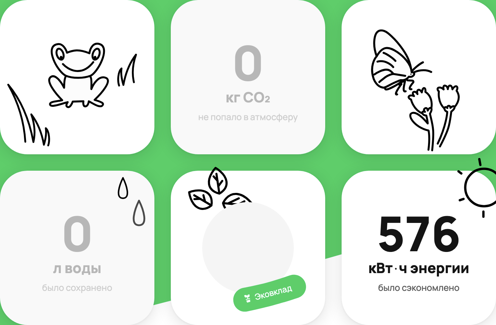

___
**ID**: BR48

**Заголовок**:

В поле Energy символ @ отображается как NaN 

**Окружение**:

ОС: Windows 10 64-bit
Браузер: Google Chrome 120.0.6099.109, разрешение 1920х1080

**Приоритет**

Средний

**Шаги**:

Открыть DevTools

Включить перезапись запросов: Sources/Overrides, чек-бокс Enable Local Overrides

Настроить перезапись ответа от роута `/web/1/charity/ecoImpact/init`
на body

`{"result":{"blocks":{"personalImpact":{"data":{"co2":0,"energy":"@","water":0,"materials":0,"pineYears":0}}},"isAuthorized":true},"status":"ok"}`

Открываем страницу https://www.avito.ru/avito-care/eco-impact

**Ожидаемый результат**:

Верстка отображается корректно
В блоке Energy отображается 0 кВт*ч

**Фактический результат**:

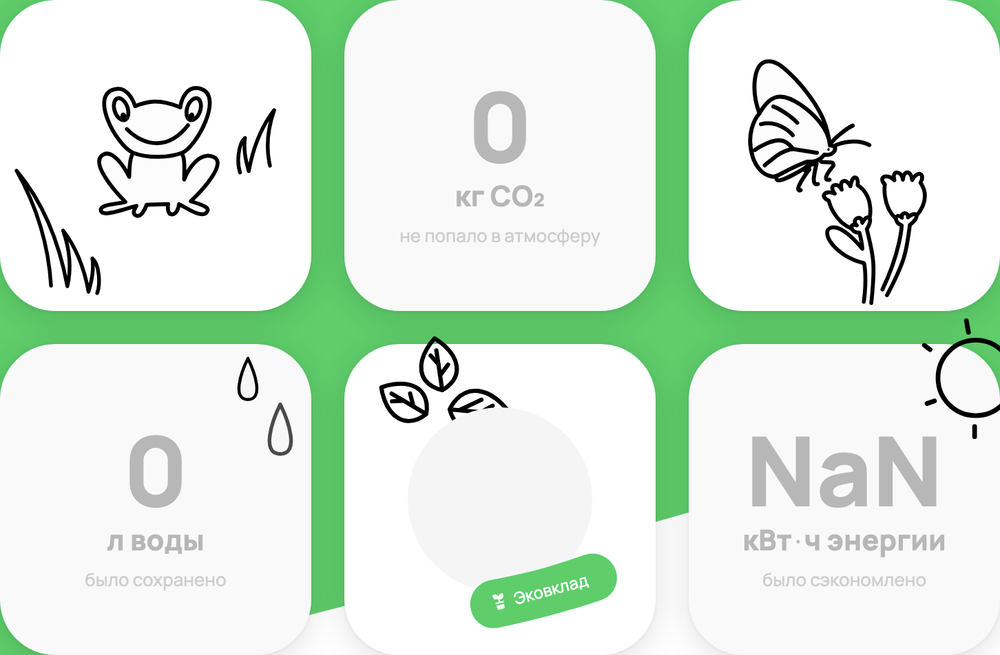

___
**ID**: BR49

**Заголовок**:

В поле Energy строка abc отображается как NaN 

**Окружение**:

ОС: Windows 10 64-bit
Браузер: Google Chrome 120.0.6099.109, разрешение 1920х1080

**Приоритет**

Средний

**Шаги**:

Открыть DevTools

Включить перезапись запросов: Sources/Overrides, чек-бокс Enable Local Overrides

Настроить перезапись ответа от роута `/web/1/charity/ecoImpact/init`
на body

`{"result":{"blocks":{"personalImpact":{"data":{"co2":0,"energy":"abc","water":0,"materials":0,"pineYears":0}}},"isAuthorized":true},"status":"ok"}`

Открываем страницу https://www.avito.ru/avito-care/eco-impact

**Ожидаемый результат**:

Верстка отображается корректно
В блоке Energy отображается 0 кВт*ч

**Фактический результат**:

