# TestCases для скриншотного тестирования

___
**ID**: 1

**Заголовок**:

Тестирование поля Co2 -500: Класс (-∞:-1] типичный представитель

**Шаги**:

1. Включаем перезапись запросов в Chrome в Dev Tools
2. Настраиваем перезапись ответа от роута /web/1/charity/ecoImpact/init
на body

`{"result":{"blocks":{"personalImpact":{"data":{"co2":-500,"energy":0,"water":0,"materials":0,"pineYears":0}}},"isAuthorized":true},"status":"ok"}`

3. Открываем страницу https://www.avito.ru/avito-care/eco-impact

**Ожидаемый результат**:

Верстка отображается корректно
В блоке Co2 отображается 0 кг

**Фактический результат**:

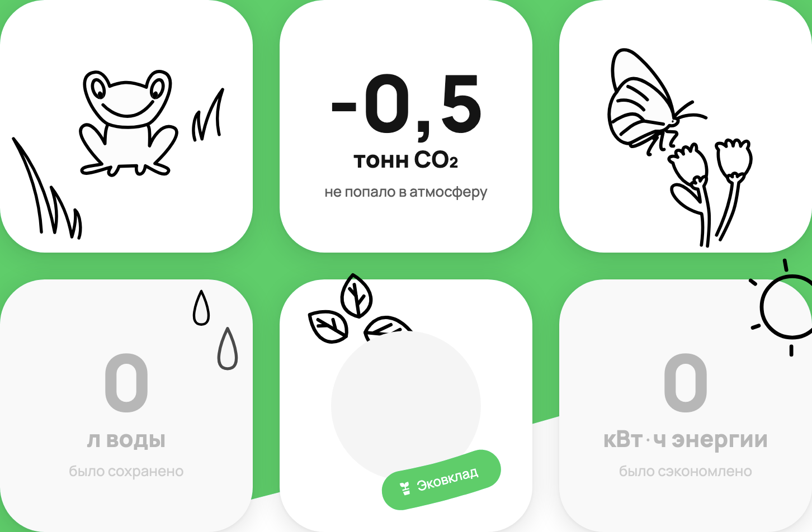

**Ссылка на баг-репорт**

[ID: BR1](BUGS.md)

___
**ID**: 2

**Заголовок**:

Тестирование поля Co2 -2: Класс (-∞:-1] шаг в границу

**Шаги**:

1. Включаем перезапись запросов в Chrome в Dev Tools
2. Настраиваем перезапись ответа от роута /web/1/charity/ecoImpact/init
на body

`{"result":{"blocks":{"personalImpact":{"data":{"co2":-2,"energy":0,"water":0,"materials":0,"pineYears":0}}},"isAuthorized":true},"status":"ok"}`

3. Открываем страницу https://www.avito.ru/avito-care/eco-impact

**Ожидаемый результат**:

Верстка отображается корректно
В блоке Co2 отображается 0 кг

**Фактический результат**:

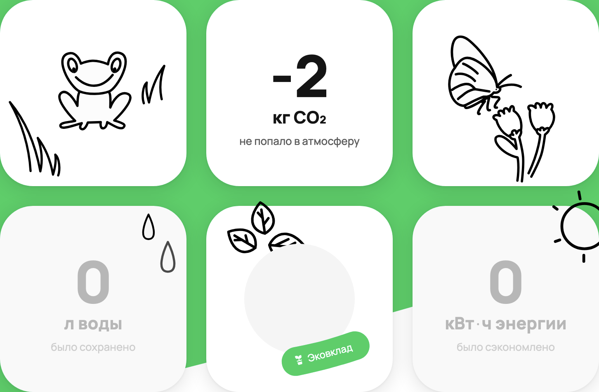

**Ссылка на баг-репорт**

[ID: BR2](BUGS.md)
___
**ID**: 3

**Заголовок**:

Тестирование поля Co2 -1: Класс (-∞:-1] граничное значение и шаг за границу для класса [0:1000)

**Шаги**:

1. Включаем перезапись запросов в Chrome в Dev Tools
2. Настраиваем перезапись ответа от роута /web/1/charity/ecoImpact/init
на body

`{"result":{"blocks":{"personalImpact":{"data":{"co2":-1,"energy":0,"water":0,"materials":0,"pineYears":0}}},"isAuthorized":true},"status":"ok"}`

3. Открываем страницу https://www.avito.ru/avito-care/eco-impact

**Ожидаемый результат**:

Верстка отображается корректно
В блоке Co2 отображается 0 кг

**Фактический результат**:

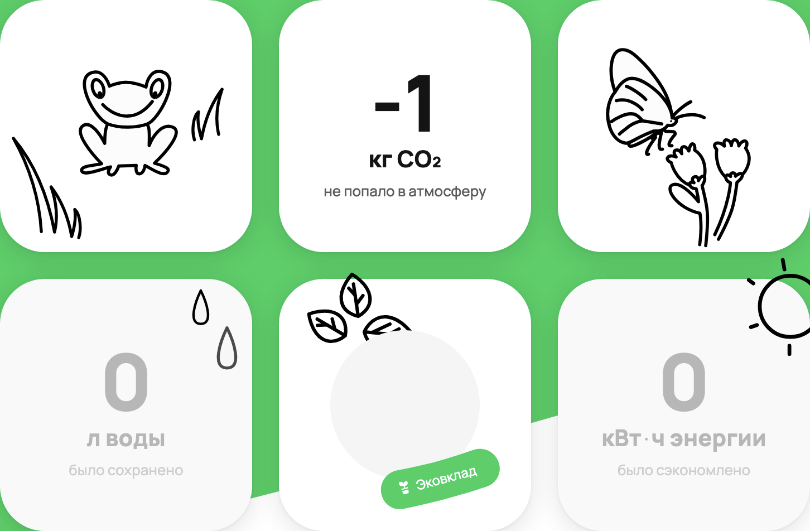

**Ссылка на баг-репорт**

[ID: BR3](BUGS.md)
___
**ID**: 4

**Заголовок**:

Тестирование поля Co2 0: Класс (-∞:-1] шаг за границу и граничное значение для класса [0:1000)

**Шаги**:

1. Включаем перезапись запросов в Chrome в Dev Tools
2. Настраиваем перезапись ответа от роута /web/1/charity/ecoImpact/init
на body

`{"result":{"blocks":{"personalImpact":{"data":{"co2":0,"energy":0,"water":0,"materials":0,"pineYears":0}}},"isAuthorized":true},"status":"ok"}`

3. Открываем страницу https://www.avito.ru/avito-care/eco-impact

**Ожидаемый результат**:

Верстка отображается корректно
В блоке Co2 отображается 0 кг

**Фактический результат**:

___
**ID**: 5

**Заголовок**:

Тестирование поля Co2 1: Шаг за границу для класса [0:1000)

**Шаги**:

1. Включаем перезапись запросов в Chrome в Dev Tools
2. Настраиваем перезапись ответа от роута /web/1/charity/ecoImpact/init
на body

`{"result":{"blocks":{"personalImpact":{"data":{"co2":1,"energy":0,"water":0,"materials":0,"pineYears":0}}},"isAuthorized":true},"status":"ok"}`

3. Открываем страницу https://www.avito.ru/avito-care/eco-impact

**Ожидаемый результат**:

Верстка отображается корректно
В блоке Co2 отображается 1 кг

**Фактический результат**:

___
**ID**: 6

**Заголовок**:

Тестирование поля Co2 500: Класс [0:1000) типичный представитель

**Шаги**:

1. Включаем перезапись запросов в Chrome в Dev Tools
2. Настраиваем перезапись ответа от роута /web/1/charity/ecoImpact/init
на body

`{"result":{"blocks":{"personalImpact":{"data":{"co2":500,"energy":0,"water":0,"materials":0,"pineYears":0}}},"isAuthorized":true},"status":"ok"}`

3. Открываем страницу https://www.avito.ru/avito-care/eco-impact

**Ожидаемый результат**:

Верстка отображается корректно
В блоке Co2 отображается 500 кг

**Фактический результат**:

___
**ID**: 7

**Заголовок**:

Тестирование поля Co2 998: Класс [0:1000) шаг в границу 

**Шаги**:

1. Включаем перезапись запросов в Chrome в Dev Tools
2. Настраиваем перезапись ответа от роута /web/1/charity/ecoImpact/init
на body

`{"result":{"blocks":{"personalImpact":{"data":{"co2":998,"energy":0,"water":0,"materials":0,"pineYears":0}}},"isAuthorized":true},"status":"ok"}`

3. Открываем страницу https://www.avito.ru/avito-care/eco-impact
**Ожидаемый результат**:

Верстка отображается корректно
В блоке
В блоке Co2 отображается 998 кг

**Фактический результат**:

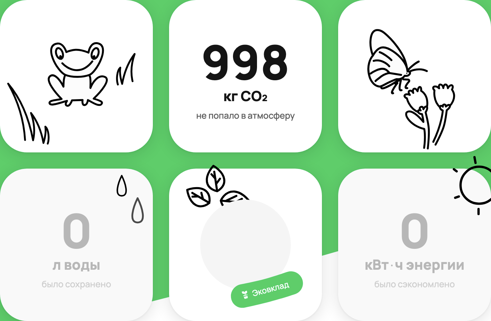

___
**ID**: 8

**Заголовок**:

Тестирование поля Co2 999: Класс [0:1000) граничное значение и шаг за границу для класса [1000:1000000)

**Шаги**:

1. Включаем перезапись запросов в Chrome в Dev Tools
2. Настраиваем перезапись ответа от роута /web/1/charity/ecoImpact/init
на body

`{"result":{"blocks":{"personalImpact":{"data":{"co2":999,"energy":0,"water":0,"materials":0,"pineYears":0}}},"isAuthorized":true},"status":"ok"}`

**Ожидаемый результат**:

Верстка отображается корректно
В блокеемый результат**:

В блоке Co2 отображается 999 кг

**Фактический результат**:

___
**ID**: 9

**Заголовок**:

Тестирование поля Co2 1000: Класс [0:1000) шаг за границу и граничное значение для класса [1000:1000000)

**Шаги**:

1. Включаем перезапись запросов в Chrome в Dev Tools
2. Настраиваем перезапись ответа от роута /web/1/charity/ecoImpact/init
на body

`{"result":{"blocks":{"personalImpact":{"data":{"co2":1000,"energy":0,"water":0,"materials":0,"pineYears":0}}},"isAuthorized":true},"status":"ok"}`
**Ожидаемый результат**:

Верстка отображается корректно
В блоке
**Ожидаемый результат**:

Верстка отображается корректно
В блоке Co2 отображается 1 тонн

**Фактический результат**:

___
**ID**: 10

**Заголовок**:

Тестирование поля Co2 1001: Шаг за границу для класса [1000:1000000)

**Шаги**:

1. Включаем перезапись запросов в Chrome в Dev Tools
2. Настраиваем перезапись ответа от роута /web/1/charity/ecoImpact/init
на body

`{"result":{"blocks":{"personalImpact":{"data":{"co2":1001,"energy":0,"water":0,"materials":0,"pineYears":0}}},"isAuthorized":true},"status":"ok"}`

3. Открываем страницу https://www.avito.ru/avito-care/eco-impact
**Ожидаемый результат**:

Верстка отображается корректно
В блоке
В блоке Co2 отображается 1 тонн

**Фактический результат**:

___
**ID**: 11

**Заголовок**:

Тестирование поля Co2 550000: Класс [1000:1000000) типичный представитель

**Шаги**:

1. Включаем перезапись запросов в Chrome в Dev Tools
2. Настраиваем перезапись ответа от роута /web/1/charity/ecoImpact/init
на body

`{"result":{"blocks":{"personalImpact":{"data":{"co2":550000,"energy":0,"water":0,"materials":0,"pineYears":0}}},"isAuthorized":true},"status":"ok"}`

**Ожидаемый результат**:

Верстка отображается корректно
В блокеемый результат**:

В блоке Co2 отображается 550 тонн

**Фактический результат**:

___
**ID**: 12

**Заголовок**:

Тестирование поля Co2 999998: Класс [1000:1000000) шаг в границу 

**Шаги**:

1. Включаем перезапись запросов в Chrome в Dev Tools
2. Настраиваем перезапись ответа от роута /web/1/charity/ecoImpact/init
на body

`{"result":{"blocks":{"personalImpact":{"data":{"co2":999998,"energy":0,"water":0,"materials":0,"pineYears":0}}},"isAuthorized":true},"status":"ok"}`
**Ожидаемый результат**:

Верстка отображается корректно
В блоке
**Ожидаемый результат**:

Верстка отображается корректно
В блоке Co2 отображается 1000 тонн

**Фактический результат**:

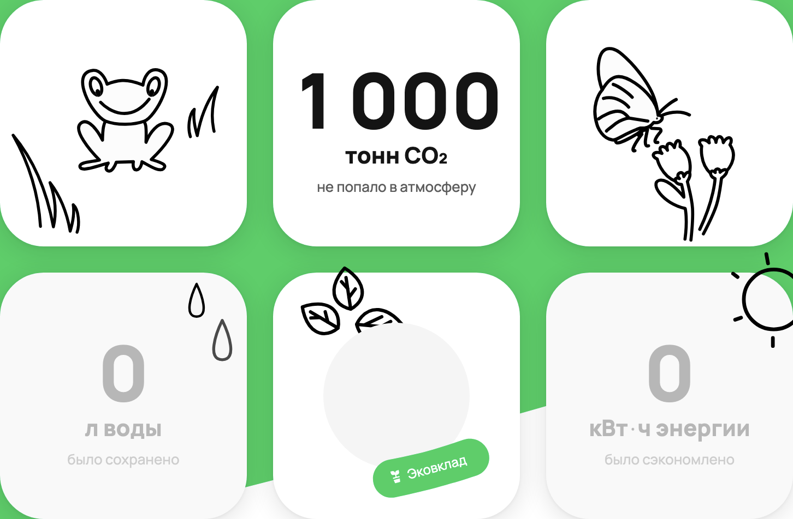

___
**ID**: 13

**Заголовок**:

Тестирование поля Co2 999999: Класс [1000:1000000) граничное значение и шаг за границу для класса [1000000:1000000000)

**Шаги**:

1. Включаем перезапись запросов в Chrome в Dev Tools
2. Настраиваем перезапись ответа от роута /web/1/charity/ecoImpact/init
на body

**Ожидаемый результат**:

Верстка отображается корректно
В блокеываем страницу https://www.avito.ru/avito-care/eco-impact
**Ожидаемый результат**:

Верстка отображается корректно
В блоке
В блоке Co2 отображается 1000 тонн

**Фактический результат**:

___
**ID**: 14

**Заголовок**:

Тестирование поля Co2 1000000: Класс [1000:1000000) шаг за границу и граничное значение для класса [1000000:1000000000)

**Шаги**:

1. Включаем перезапись запросов в Chrome в Dev Tools
2. Настраиваем перезапись ответа от роута /web/1/charity/ecoImpact/init
на body

`{"result":{"blocks":{"personalImpact":{"data":{"co2":1000000,"energy":0,"water":0,"materials":0,"pineYears":0}}},"isAuthorized":true},"status":"ok"}`

3. Открываем страницу https://www.avito.ru/avito-care/eco-impact

**Ожидаемый результат**:

Верстка отображается корректно
В блоке Co2 отображается 1 тыс тонн

**Фактический результат**:

**Ссылка на баг-репорт**

[ID: BR4](BUGS.md)
___
**ID**: 15

**Заголовок**:

Тестирование поля Co2 1000001: Шаг за границу для класса [1000000:1000000000)

**Шаги**:

1. Включаем перезапись запросов в Chrome в Dev Tools
2. Настраиваем перезапись ответа от роута /web/1/charity/ecoImpact/init
на body

`{"result":{"blocks":{"personalImpact":{"data":{"co2":1000001,"energy":0,"water":0,"materials":0,"pineYears":0}}},"isAuthorized":true},"status":"ok"}`

3. Открываем страницу https://www.avito.ru/avito-care/eco-impact
**Ожидаемый результат**:

Верстка отображается корректно
В блоке Co2 отображается 1 тыс тонн

**Фактический результат**:

**Ссылка на баг-репорт**

[ID: BR5](BUGS.md)
___
**ID**: 16

**Заголовок**:

Тестирование поля Co2 550000000: Класс [1000000:1000000000) типичный представитель

**Шаги**:

1. Включаем перезапись запросов в Chrome в Dev Tools
2. Настраиваем перезапись ответа от роута /web/1/charity/ecoImpact/init
на body

`{"result":{"blocks":{"personalImpact":{"data":{"co2":550000000,"energy":0,"water":0,"materials":0,"pineYears":0}}},"isAuthorized":true},"status":"ok"}`

**Ожидаемый результат**:

Верстка отображается корректно
В блоке Co2 отображается 550 тыс тонн

**Фактический результат**:

**Ссылка на баг-репорт**

[ID: BR6](BUGS.md)
___
**ID**: 17

**Заголовок**:

Тестирование поля Co2 999999998: Класс [1000000:1000000000) шаг в границу 

**Шаги**:

1. Включаем перезапись запросов в Chrome в Dev Tools
2. Настраиваем перезапись ответа от роута /web/1/charity/ecoImpact/init
на body

`{"result":{"blocks":{"personalImpact":{"data":{"co2":999999998,"energy":0,"water":0,"materials":0,"pineYears":0}}},"isAuthorized":true},"status":"ok"}`

3. Открываем страницу https://www.avito.ru/avito-care/eco-impact

**Ожидаемый результат**:

Верстка отображается корректно
В блоке Co2 отображается 1000 тыс тонн

**Фактический результат**:

**Ссылка на баг-репорт**

[ID: BR7](BUGS.md)
___
**ID**: 18

**Заголовок**:

Тестирование поля Co2 999999999: Класс [1000000:1000000000) граничное значение и шаг за границу для класса [1000000000:1000000000000)

**Шаги**:

1. Включаем перезапись запросов в Chrome в Dev Tools
2. Настраиваем перезапись ответа от роута /web/1/charity/ecoImpact/init
на body

`{"result":{"blocks":{"personalImpact":{"data":{"co2":999999999,"energy":0,"water":0,"materials":0,"pineYears":0}}},"isAuthorized":true},"status":"ok"}`

3. Открываем страницу https://www.avito.ru/avito-care/eco-impact

**Ожидаемый результат**:

Верстка отображается корректно
В блоке Co2 отображается 1000 тыс тонн

**Фактический результат**:

**Ссылка на баг-репорт**

[ID: BR8](BUGS.md)
___
**ID**: 19

**Заголовок**:

Тестирование поля Co2 1000000000: Класс [1000000:1000000000) шаг за границу и граничное значение для класса [1000000000:1000000000000)

**Шаги**:

1. Включаем перезапись запросов в Chrome в Dev Tools
2. Настраиваем перезапись ответа от роута /web/1/charity/ecoImpact/init
на body

`{"result":{"blocks":{"personalImpact":{"data":{"co2":1000000000,"energy":0,"water":0,"materials":0,"pineYears":0}}},"isAuthorized":true},"status":"ok"}`

3. Открываем страницу https://www.avito.ru/avito-care/eco-impact

**Ожидаемый результат**:

Верстка отображается корректно
В блоке Co2 отображается 1 млн тонн

**Фактический результат**:

___
**ID**: 20

**Заголовок**:

Тестирование поля Co2 1000000001: Шаг за границу для класса [1000000000:1000000000000)

**Шаги**:

1. Включаем перезапись запросов в Chrome в Dev Tools
2. Настраиваем перезапись ответа от роута /web/1/charity/ecoImpact/init
на body

`{"result":{"blocks":{"personalImpact":{"data":{"co2":1000000001,"energy":0,"water":0,"materials":0,"pineYears":0}}},"isAuthorized":true},"status":"ok"}`

3. Открываем страницу https://www.avito.ru/avito-care/eco-impact

**Ожидаемый результат**:

Верстка отображается корректно
В блоке Co2 отображается 1 млн тонн

**Фактический результат**:

___
**ID**: 21

**Заголовок**:

Тестирование поля Co2 550000000000: Класс [1000000000:1000000000000) типичный представитель

**Шаги**:

1. Включаем перезапись запросов в Chrome в Dev Tools
2. Настраиваем перезапись ответа от роута /web/1/charity/ecoImpact/init
на body

`{"result":{"blocks":{"personalImpact":{"data":{"co2":550000000000,"energy":0,"water":0,"materials":0,"pineYears":0}}},"isAuthorized":true},"status":"ok"}`

3. Открываем страницу https://www.avito.ru/avito-care/eco-impact

**Ожидаемый результат**:

Верстка отображается корректно
В блоке Co2 отображается 550 млн тонн

**Фактический результат**:

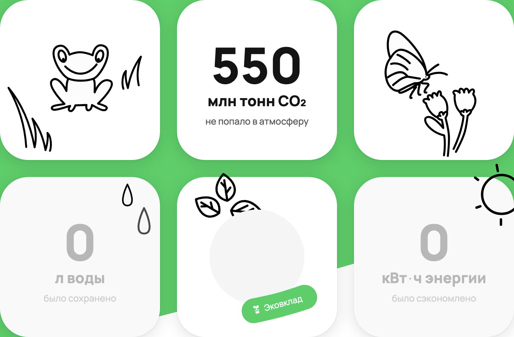

___
**ID**: 22

**Заголовок**:

Тестирование поля Co2 999999999998: Класс [1000000000:1000000000000) шаг в границу 

**Шаги**:

1. Включаем перезапись запросов в Chrome в Dev Tools
2. Настраиваем перезапись ответа от роута /web/1/charity/ecoImpact/init
на body

`{"result":{"blocks":{"personalImpact":{"data":{"co2":999999999998,"energy":0,"water":0,"materials":0,"pineYears":0}}},"isAuthorized":true},"status":"ok"}`

3. Открываем страницу https://www.avito.ru/avito-care/eco-impact

**Ожидаемый результат**:

Верстка отображается корректно
В блоке Co2 отображается 1000 млн тонн

**Фактический результат**:

___
**ID**: 23

**Заголовок**:

Тестирование поля Co2 999999999999: Класс [1000000000:1000000000000) граничное значение и шаг за границу для класса [1000000000000:1000000000000000)

**Шаги**:

1. Включаем перезапись запросов в Chrome в Dev Tools
2. Настраиваем перезапись ответа от роута /web/1/charity/ecoImpact/init
на body

`{"result":{"blocks":{"personalImpact":{"data":{"co2":999999999999,"energy":0,"water":0,"materials":0,"pineYears":0}}},"isAuthorized":true},"status":"ok"}`

3. Открываем страницу https://www.avito.ru/avito-care/eco-impact

**Ожидаемый результат**:

Верстка отображается корректно
В блоке Co2 отображается 1000 млн тонн

**Фактический результат**:

___
**ID**: 24

**Заголовок**:

Тестирование поля Co2 1000000000000: Класс [1000000000:1000000000000) шаг за границу и граничное значение для класса [1000000000000:1000000000000000)

**Шаги**:

1. Включаем перезапись запросов в Chrome в Dev Tools
2. Настраиваем перезапись ответа от роута /web/1/charity/ecoImpact/init
на body

`{"result":{"blocks":{"personalImpact":{"data":{"co2":1000000000000,"energy":0,"water":0,"materials":0,"pineYears":0}}},"isAuthorized":true},"status":"ok"}`

3. Открываем страницу https://www.avito.ru/avito-care/eco-impact

**Ожидаемый результат**:

Верстка отображается корректно
В блоке Co2 отображается 1 млрд тонн

**Фактический результат**:

___
**ID**: 25

**Заголовок**:

Тестирование поля Co2 1000000000001: Шаг за границу для класса [1000000000000:1000000000000000)

**Шаги**:

1. Включаем перезапись запросов в Chrome в Dev Tools
2. Настраиваем перезапись ответа от роута /web/1/charity/ecoImpact/init
на body

`{"result":{"blocks":{"personalImpact":{"data":{"co2":1000000000001,"energy":0,"water":0,"materials":0,"pineYears":0}}},"isAuthorized":true},"status":"ok"}`

3. Открываем страницу https://www.avito.ru/avito-care/eco-impact

**Ожидаемый результат**:

Верстка отображается корректно
В блоке Co2 отображается 1 млрд тонн

**Фактический результат**:

___
**ID**: 26

**Заголовок**:

Тестирование поля Co2 550000000000000: Класс [1000000000000:1000000000000000)типичный представитель

**Шаги**:

1. Включаем перезапись запросов в Chrome в Dev Tools
2. Настраиваем перезапись ответа от роута /web/1/charity/ecoImpact/init
на body

`{"result":{"blocks":{"personalImpact":{"data":{"co2":550000000000000,"energy":0,"water":0,"materials":0,"pineYears":0}}},"isAuthorized":true},"status":"ok"}`

3. Открываем страницу https://www.avito.ru/avito-care/eco-impact

**Ожидаемый результат**:

Верстка отображается корректно
В блоке Co2 отображается 550 млрд тонн

**Фактический результат**:

___
**ID**: 27

**Заголовок**:

Тестирование поля Co2 999999999999998: Класс [1000000000000:1000000000000000) шаг в границу 

**Шаги**:

1. Включаем перезапись запросов в Chrome в Dev Tools
2. Настраиваем перезапись ответа от роута /web/1/charity/ecoImpact/init
на body

`{"result":{"blocks":{"personalImpact":{"data":{"co2":999999999999998,"energy":0,"water":0,"materials":0,"pineYears":0}}},"isAuthorized":true},"status":"ok"}`

3. Открываем страницу https://www.avito.ru/avito-care/eco-impact

**Ожидаемый результат**:

Верстка отображается корректно
В блоке Co2 отображается 1000 млрд тонн

**Фактический результат**:

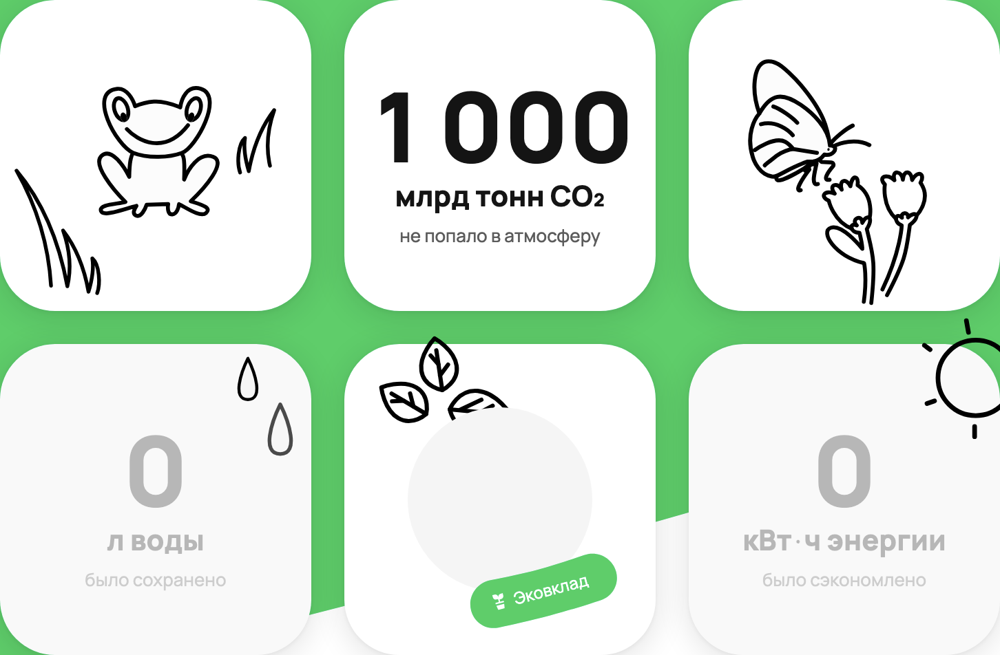

___
**ID**: 28

**Заголовок**:

Тестирование поля Co2 999999999999999: Класс [1000000000000:1000000000000000) граничное значение и шаг за границу для класса [1000000000000000:1000000000000000000)

**Шаги**:

1. Включаем перезапись запросов в Chrome в Dev Tools
2. Настраиваем перезапись ответа от роута /web/1/charity/ecoImpact/init
на body

`{"result":{"blocks":{"personalImpact":{"data":{"co2":999999999999999,"energy":0,"water":0,"materials":0,"pineYears":0}}},"isAuthorized":true},"status":"ok"}`

3. Открываем страницу https://www.avito.ru/avito-care/eco-impact

**Ожидаемый результат**:

Верстка отображается корректно
В блоке Co2 отображается 1000 млрд тонн

**Фактический результат**:

___
**ID**: 29

**Заголовок**:

Тестирование поля Co2 1000000000000000: Класс [1000000000000:1000000000000000) шаг за границу и граничное значение для класса [1000000000000000:1000000000000000000)

**Шаги**:

1. Включаем перезапись запросов в Chrome в Dev Tools
2. Настраиваем перезапись ответа от роута /web/1/charity/ecoImpact/init
на body

`{"result":{"blocks":{"personalImpact":{"data":{"co2":1000000000000000,"energy":0,"water":0,"materials":0,"pineYears":0}}},"isAuthorized":true},"status":"ok"}`

3. Открываем страницу https://www.avito.ru/avito-care/eco-impact

**Ожидаемый результат**:

Верстка отображается корректно
В блоке Co2 отображается 1 трлн тонн

**Фактический результат**:

**Ссылка на баг-репорт**

[ID: BR9](BUGS.md)
___
**ID**: 30

**Заголовок**:

Тестирование поля Co2 1000000000000001: Шаг за границу для класса [1000000000000000:1000000000000000000)

**Шаги**:

1. Включаем перезапись запросов в Chrome в Dev Tools
2. Настраиваем перезапись ответа от роута /web/1/charity/ecoImpact/init
на body

`{"result":{"blocks":{"personalImpact":{"data":{"co2":1000000000000001,"energy":0,"water":0,"materials":0,"pineYears":0}}},"isAuthorized":true},"status":"ok"}`

3. Открываем страницу https://www.avito.ru/avito-care/eco-impact

**Ожидаемый результат**:

Верстка отображается корректно
В блоке Co2 отображается 1 трлн тонн

**Фактический результат**:

**Ссылка на баг-репорт**

[ID: BR10](BUGS.md)
___
**ID**: 31

**Заголовок**:

Тестирование поля Co2 число 576 строкой: Проверка на класс эквивалентности число строкой

**Шаги**:

1. Включаем перезапись запросов в Chrome в Dev Tools
2. Настраиваем перезапись ответа от роута /web/1/charity/ecoImpact/init
на body

`{"result":{"blocks":{"personalImpact":{"data":{"co2":"576","energy":0,"water":0,"materials":0,"pineYears":0}}},"isAuthorized":true},"status":"ok"}`

3. Открываем страницу https://www.avito.ru/avito-care/eco-impact

**Ожидаемый результат**:

Верстка отображается корректно
В блоке Co2 отображается 0 кг

**Фактический результат**:

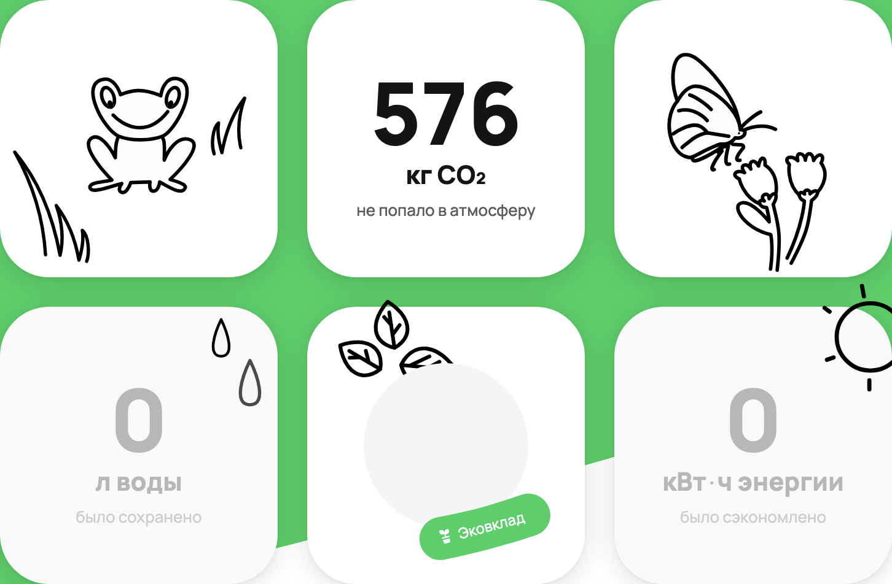

**Ссылка на баг-репорт**

[ID: BR11](BUGS.md)
___
**ID**: 32

**Заголовок**:

Тестирование поля Co2 дробное число 11.6: Проверка на класс эквивалентности число строкой

**Шаги**:

1. Включаем перезапись запросов в Chrome в Dev Tools
2. Настраиваем перезапись ответа от роута /web/1/charity/ecoImpact/init
на body

`{"result":{"blocks":{"personalImpact":{"data":{"co2":11.6,"energy":0,"water":0,"materials":0,"pineYears":0}}},"isAuthorized":true},"status":"ok"}`

3. Открываем страницу https://www.avito.ru/avito-care/eco-impact

**Ожидаемый результат**:

Верстка отображается корректно
В блоке Co2 отображается 12 кг

**Фактический результат**:

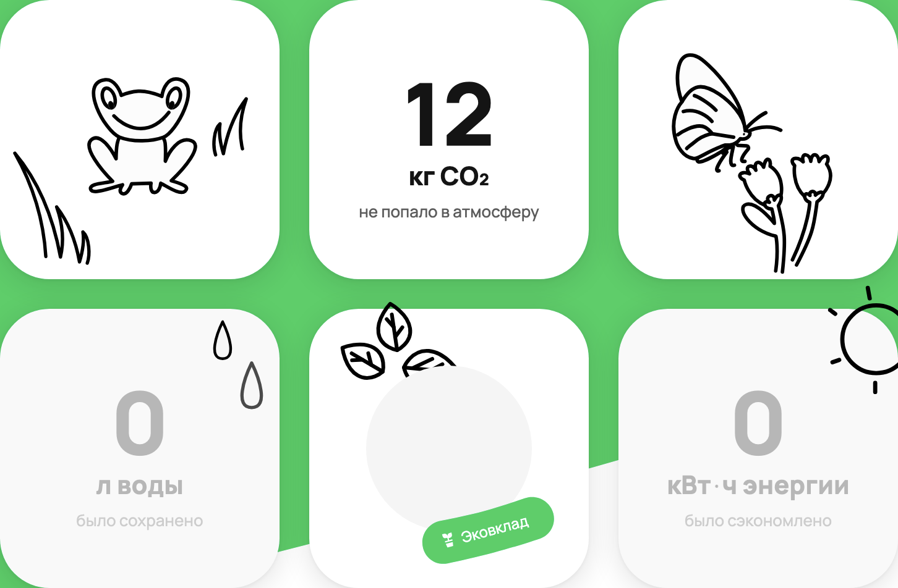

___
**ID**: 33

**Заголовок**:

Тестирование поля Co2 null вместо числа: Проверка на класс эквивалентности null

**Шаги**:

1. Включаем перезапись запросов в Chrome в Dev Tools
2. Настраиваем перезапись ответа от роута /web/1/charity/ecoImpact/init
на body

`{"result":{"blocks":{"personalImpact":{"data":{"co2":null,"energy":0,"water":0,"materials":0,"pineYears":0}}},"isAuthorized":true},"status":"ok"}`

3. Открываем страницу https://www.avito.ru/avito-care/eco-impact

**Ожидаемый результат**:

Верстка отображается корректно
В блоке Co2 отображается 0 кг

**Фактический результат**:

___
**ID**: 34

**Заголовок**:

Тестирование поля Co2 @ вместо числа: Проверка на класс эквивалентности спецсимвол

**Шаги**:

1. Включаем перезапись запросов в Chrome в Dev Tools
2. Настраиваем перезапись ответа от роута /web/1/charity/ecoImpact/init
на body

`{"result":{"blocks":{"personalImpact":{"data":{"co2":"@","energy":0,"water":0,"materials":0,"pineYears":0}}},"isAuthorized":true},"status":"ok"}`

3. Открываем страницу https://www.avito.ru/avito-care/eco-impact

**Ожидаемый результат**:

Верстка отображается корректно
В блоке Co2 отображается 0 кг

**Фактический результат**:

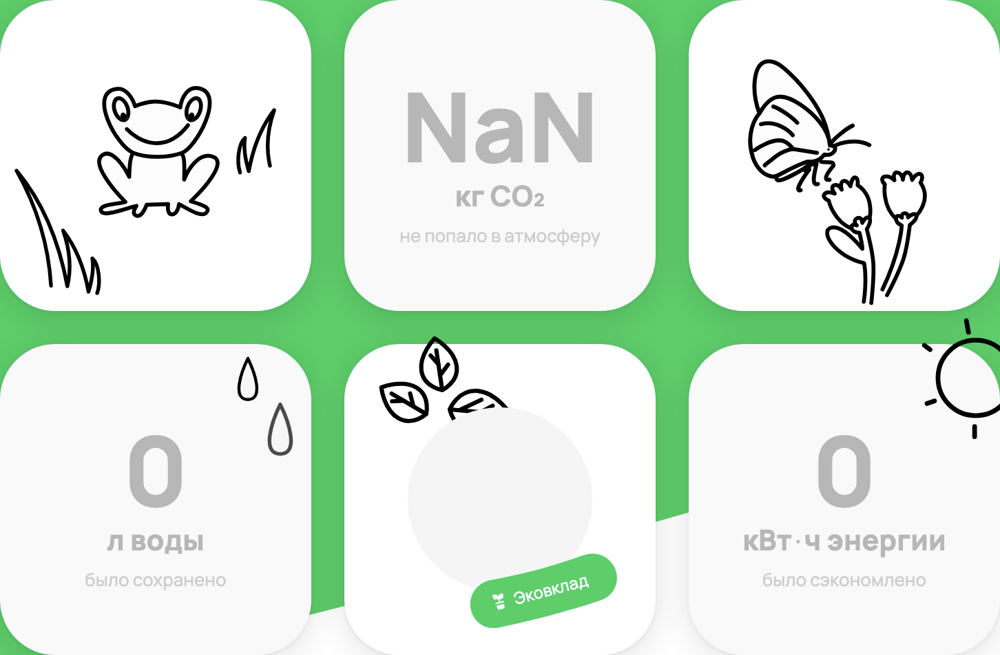

**Ссылка на баг-репорт**

[ID: BR12](BUGS.md)
___
**ID**: 35

**Заголовок**:

Тестирование поля Co2 строка abc вместо числа: Проверка на класс эквивалентности буквы

**Шаги**:

1. Включаем перезапись запросов в Chrome в Dev Tools
2. Настраиваем перезапись ответа от роута /web/1/charity/ecoImpact/init
на body

`{"result":{"blocks":{"personalImpact":{"data":{"co2":"abc","energy":0,"water":0,"materials":0,"pineYears":0}}},"isAuthorized":true},"status":"ok"}`

3. Открываем страницу https://www.avito.ru/avito-care/eco-impact

**Ожидаемый результат**:

Верстка отображается корректно
В блоке Co2 отображается 0 кг

**Фактический результат**:

**Ссылка на баг-репорт**

[ID: BR13](BUGS.md)
___
**ID**: 36

**Заголовок**:

Тестирование поля Water -500: Класс (-∞:-1] типичный представитель

**Шаги**:

1. Включаем перезапись запросов в Chrome в Dev Tools
2. Настраиваем перезапись ответа от роута /web/1/charity/ecoImpact/init
на body

`{"result":{"blocks":{"personalImpact":{"data":{"co2":0,"energy":0,"water":-500,"materials":0,"pineYears":0}}},"isAuthorized":true},"status":"ok"}`

3. Открываем страницу https://www.avito.ru/avito-care/eco-impact

**Ожидаемый результат**:

Верстка отображается корректно
В блоке Water отображается 0 л

**Фактический результат**:

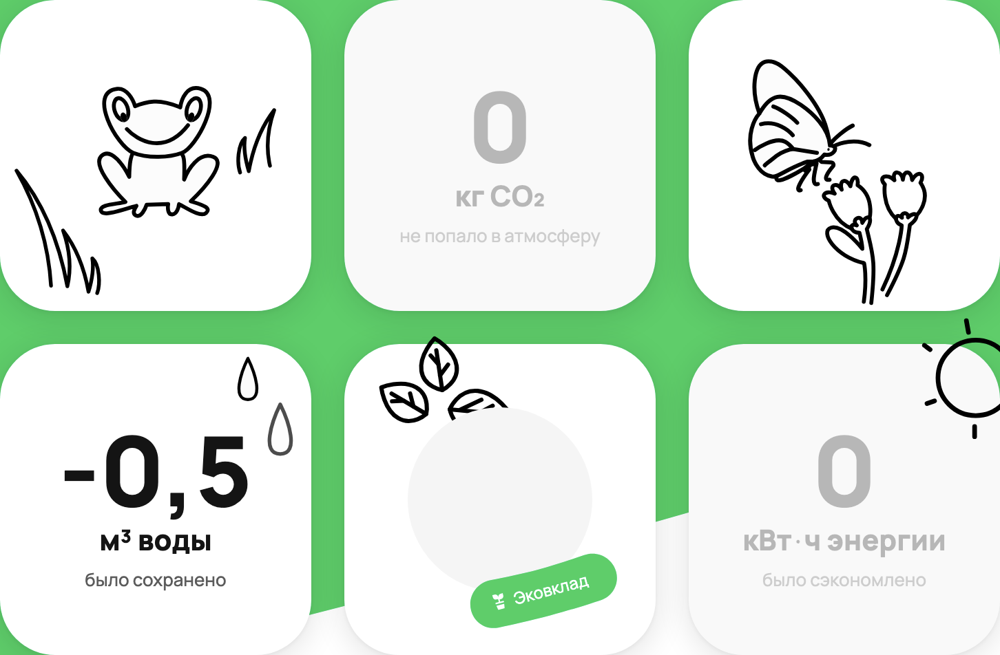

**Ссылка на баг-репорт**

[ID: BR14](BUGS.md)
___
**ID**: 37

**Заголовок**:

Тестирование поля Water -2: Класс (-∞:-1] шаг в границу

**Шаги**:

1. Включаем перезапись запросов в Chrome в Dev Tools
2. Настраиваем перезапись ответа от роута /web/1/charity/ecoImpact/init
на body

`{"result":{"blocks":{"personalImpact":{"data":{"co2":0,"energy":0,"water":-2,"materials":0,"pineYears":0}}},"isAuthorized":true},"status":"ok"}`

3. Открываем страницу https://www.avito.ru/avito-care/eco-impact

**Ожидаемый результат**:

Верстка отображается корректно
В блоке Water отображается 0 л

**Фактический результат**:

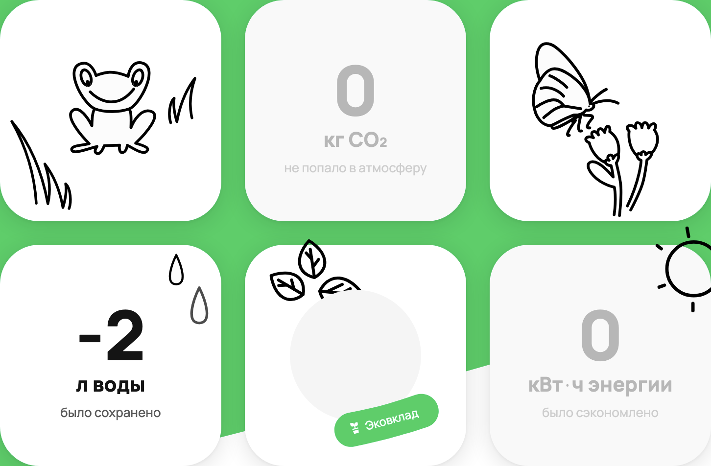

**Ссылка на баг-репорт**

[ID: BR15](BUGS.md)
___
**ID**: 38

**Заголовок**:

Тестирование поля Water -1: Класс (-∞:-1] граничное значение и шаг за границу для класса [0:1000)

**Шаги**:

1. Включаем перезапись запросов в Chrome в Dev Tools
2. Настраиваем перезапись ответа от роута /web/1/charity/ecoImpact/init
на body

`{"result":{"blocks":{"personalImpact":{"data":{"co2":0,"energy":0,"water":-1,"materials":0,"pineYears":0}}},"isAuthorized":true},"status":"ok"}`

3. Открываем страницу https://www.avito.ru/avito-care/eco-impact

**Ожидаемый результат**:

Верстка отображается корректно
В блоке Water отображается 0 л

**Фактический результат**:

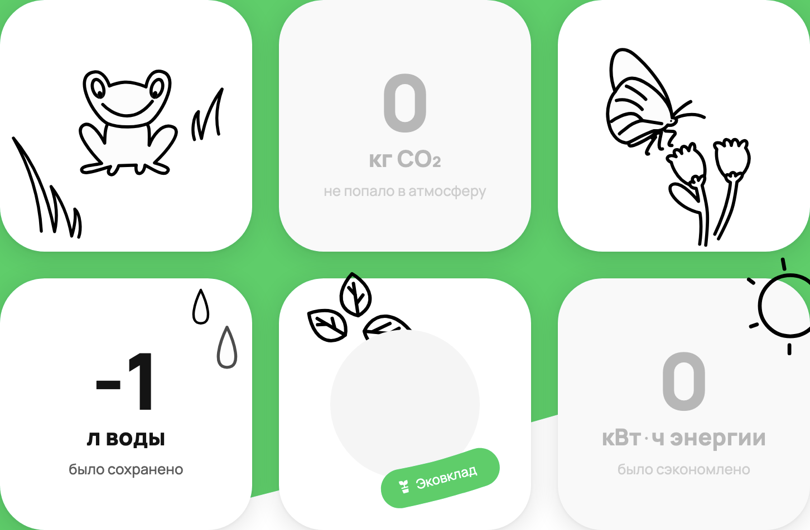

**Ссылка на баг-репорт**

[ID: BR16](BUGS.md)
___
**ID**: 39

**Заголовок**:

Тестирование поля Water 0: Класс (-∞:-1] шаг за границу и граничное значение для класса [0:1000)

**Шаги**:

1. Включаем перезапись запросов в Chrome в Dev Tools
2. Настраиваем перезапись ответа от роута /web/1/charity/ecoImpact/init
на body

`{"result":{"blocks":{"personalImpact":{"data":{"co2":0,"energy":0,"water":0,"materials":0,"pineYears":0}}},"isAuthorized":true},"status":"ok"}`

3. Открываем страницу https://www.avito.ru/avito-care/eco-impact

**Ожидаемый результат**:

Верстка отображается корректно
В блоке Water отображается 0 л

**Фактический результат**:

___
**ID**: 40

**Заголовок**:

Тестирование поля Water 1: Шаг за границу для класса [0:1000)

**Шаги**:

1. Включаем перезапись запросов в Chrome в Dev Tools
2. Настраиваем перезапись ответа от роута /web/1/charity/ecoImpact/init
на body

`{"result":{"blocks":{"personalImpact":{"data":{"co2":0,"energy":0,"water":1,"materials":0,"pineYears":0}}},"isAuthorized":true},"status":"ok"}`

3. Открываем страницу https://www.avito.ru/avito-care/eco-impact

**Ожидаемый результат**:

Верстка отображается корректно
В блоке Water отображается 1 л

**Фактический результат**:

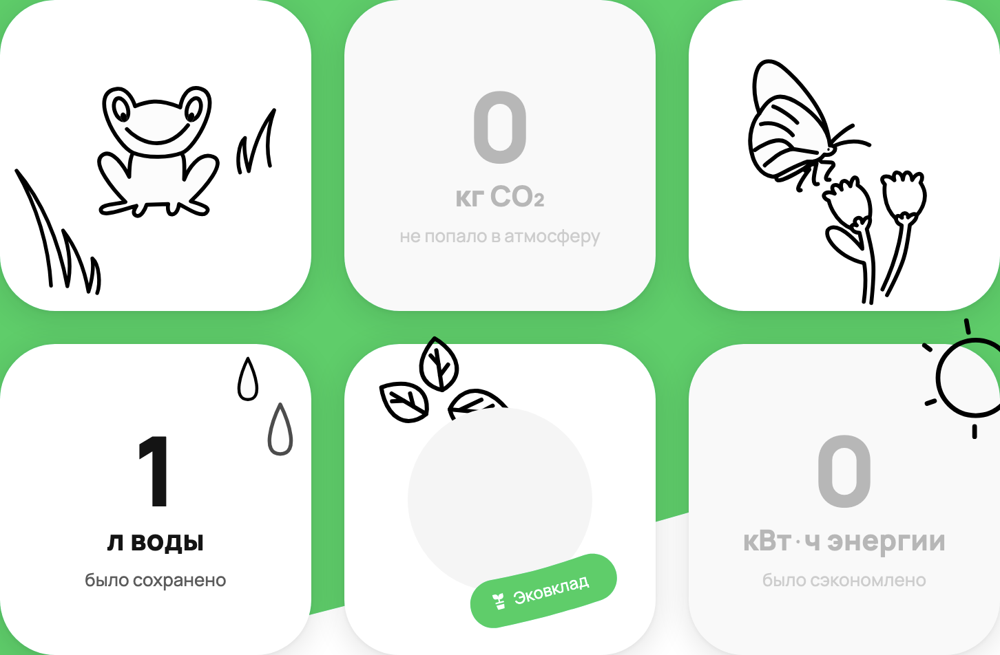

___
**ID**: 41

**Заголовок**:

Тестирование поля Water 500: Класс [0:1000) типичный представитель

**Шаги**:

1. Включаем перезапись запросов в Chrome в Dev Tools
2. Настраиваем перезапись ответа от роута /web/1/charity/ecoImpact/init
на body

`{"result":{"blocks":{"personalImpact":{"data":{"co2":0,"energy":0,"water":500,"materials":0,"pineYears":0}}},"isAuthorized":true},"status":"ok"}`

3. Открываем страницу https://www.avito.ru/avito-care/eco-impact

**Ожидаемый результат**:

Верстка отображается корректно
В блоке Water отображается 500 л

**Фактический результат**:

___
**ID**: 42

**Заголовок**:

Тестирование поля Water 998: Класс [0:1000) шаг в границу 

**Шаги**:

1. Включаем перезапись запросов в Chrome в Dev Tools
2. Настраиваем перезапись ответа от роута /web/1/charity/ecoImpact/init
на body

`{"result":{"blocks":{"personalImpact":{"data":{"co2":0,"energy":0,"water":998,"materials":0,"pineYears":0}}},"isAuthorized":true},"status":"ok"}`

3. Открываем страницу https://www.avito.ru/avito-care/eco-impact

**Ожидаемый результат**:

Верстка отображается корректно
В блоке Water отображается 998 л

**Фактический результат**:

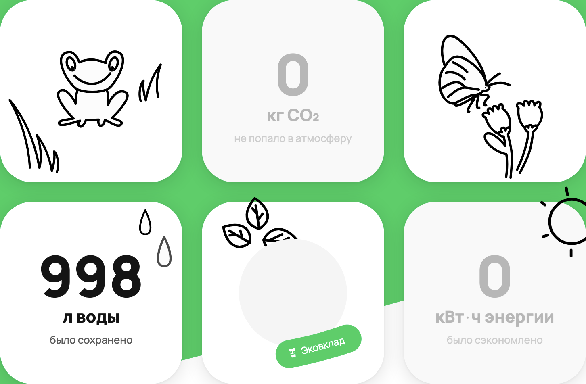

___
**ID**: 43

**Заголовок**:

Тестирование поля Water 999: Класс [0:1000) граничное значение и шаг за границу для класса [1000:1000000)

**Шаги**:

1. Включаем перезапись запросов в Chrome в Dev Tools
2. Настраиваем перезапись ответа от роута /web/1/charity/ecoImpact/init
на body

`{"result":{"blocks":{"personalImpact":{"data":{"co2":0,"energy":0,"water":999,"materials":0,"pineYears":0}}},"isAuthorized":true},"status":"ok"}`

3. Открываем страницу https://www.avito.ru/avito-care/eco-impact

**Ожидаемый результат**:

Верстка отображается корректно
В блоке Water отображается 999 л

**Фактический результат**:

___
**ID**: 44

**Заголовок**:

Тестирование поля Water 1000: Класс [0:1000) шаг за границу и граничное значение для класса [1000:1000000)

**Шаги**:

1. Включаем перезапись запросов в Chrome в Dev Tools
2. Настраиваем перезапись ответа от роута /web/1/charity/ecoImpact/init
на body

`{"result":{"blocks":{"personalImpact":{"data":{"co2":0,"energy":0,"water":1000,"materials":0,"pineYears":0}}},"isAuthorized":true},"status":"ok"}`

3. Открываем страницу https://www.avito.ru/avito-care/eco-impact

**Ожидаемый результат**:

Верстка отображается корректно
В блоке Water отображается 1 м³

**Фактический результат**:

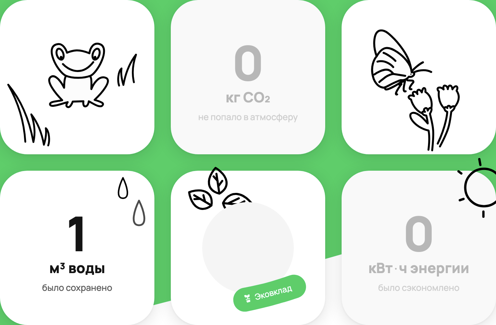

___
**ID**: 45

**Заголовок**:

Тестирование поля Water 1001: Шаг за границу для класса [1000:1000000)

**Шаги**:

1. Включаем перезапись запросов в Chrome в Dev Tools
2. Настраиваем перезапись ответа от роута /web/1/charity/ecoImpact/init
на body

`{"result":{"blocks":{"personalImpact":{"data":{"co2":0,"energy":0,"water":1001,"materials":0,"pineYears":0}}},"isAuthorized":true},"status":"ok"}`

3. Открываем страницу https://www.avito.ru/avito-care/eco-impact

**Ожидаемый результат**:

Верстка отображается корректно
В блоке Water отображается 1 м³

**Фактический результат**:

___
**ID**: 46

**Заголовок**:

Тестирование поля Water 550000: Класс [1000:1000000) типичный представитель

**Шаги**:

1. Включаем перезапись запросов в Chrome в Dev Tools
2. Настраиваем перезапись ответа от роута /web/1/charity/ecoImpact/init
на body

`{"result":{"blocks":{"personalImpact":{"data":{"co2":0,"energy":0,"water":550000,"materials":0,"pineYears":0}}},"isAuthorized":true},"status":"ok"}`

3. Открываем страницу https://www.avito.ru/avito-care/eco-impact

**Ожидаемый результат**:

Верстка отображается корректно
В блоке Water отображается 550 м³

**Фактический результат**:

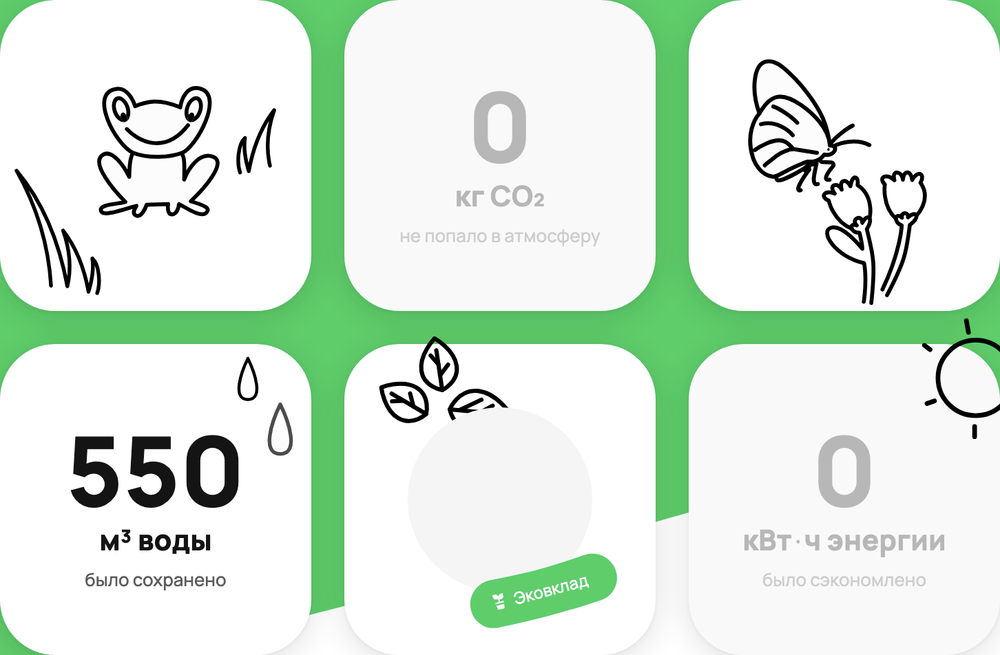

___
**ID**: 47

**Заголовок**:

Тестирование поля Water 999998: Класс [1000:1000000) шаг в границу 

**Шаги**:

1. Включаем перезапись запросов в Chrome в Dev Tools
2. Настраиваем перезапись ответа от роута /web/1/charity/ecoImpact/init
на body

`{"result":{"blocks":{"personalImpact":{"data":{"co2":0,"energy":0,"water":999998,"materials":0,"pineYears":0}}},"isAuthorized":true},"status":"ok"}`

3. Открываем страницу https://www.avito.ru/avito-care/eco-impact

**Ожидаемый результат**:

Верстка отображается корректно
В блоке Water отображается 1000 м³

**Фактический результат**:

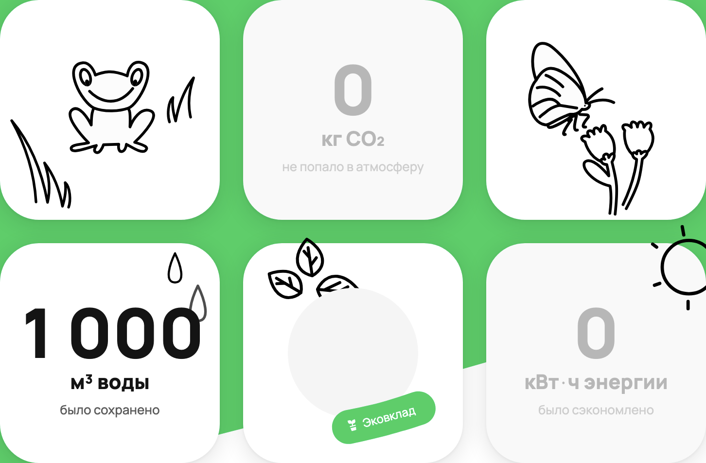

___
**ID**: 48

**Заголовок**:

Тестирование поля Water 999999: Класс [1000:1000000) граничное значение и шаг за границу для класса [1000000:1000000000)

**Шаги**:

1. Включаем перезапись запросов в Chrome в Dev Tools
2. Настраиваем перезапись ответа от роута /web/1/charity/ecoImpact/init
на body

`{"result":{"blocks":{"personalImpact":{"data":{"co2":0,"energy":0,"water":999999,"materials":0,"pineYears":0}}},"isAuthorized":true},"status":"ok"}`

3. Открываем страницу https://www.avito.ru/avito-care/eco-impact

**Ожидаемый результат**:

Верстка отображается корректно
В блоке Water отображается 1000 м³

**Фактический результат**:

___
**ID**: 49

**Заголовок**:

Тестирование поля Water 1000000: Класс [1000:1000000) шаг за границу и граничное значение для класса [1000000:1000000000)

**Шаги**:

1. Включаем перезапись запросов в Chrome в Dev Tools
2. Настраиваем перезапись ответа от роута /web/1/charity/ecoImpact/init
на body

`{"result":{"blocks":{"personalImpact":{"data":{"co2":0,"energy":0,"water":1000000,"materials":0,"pineYears":0}}},"isAuthorized":true},"status":"ok"}`

3. Открываем страницу https://www.avito.ru/avito-care/eco-impact

**Ожидаемый результат**:

Верстка отображается корректно
В блоке Water отображается 1 тыс м³

**Фактический результат**:

___
**ID**: 50

**Заголовок**:

Тестирование поля Water 1000001: Шаг за границу для класса [1000000:1000000000)

**Шаги**:

1. Включаем перезапись запросов в Chrome в Dev Tools
2. Настраиваем перезапись ответа от роута /web/1/charity/ecoImpact/init
на body

`{"result":{"blocks":{"personalImpact":{"data":{"co2":0,"energy":0,"water":1000001,"materials":0,"pineYears":0}}},"isAuthorized":true},"status":"ok"}`

3. Открываем страницу https://www.avito.ru/avito-care/eco-impact

**Ожидаемый результат**:

Верстка отображается корректно
В блоке Water отображается 1 тыс м³

**Фактический результат**:

___
**ID**: 51

**Заголовок**:

Тестирование поля Water 550000000: Класс [1000000:1000000000) типичный представитель

**Шаги**:

1. Включаем перезапись запросов в Chrome в Dev Tools
2. Настраиваем перезапись ответа от роута /web/1/charity/ecoImpact/init
на body

`{"result":{"blocks":{"personalImpact":{"data":{"co2":0,"energy":0,"water":550000000,"materials":0,"pineYears":0}}},"isAuthorized":true},"status":"ok"}`

3. Открываем страницу https://www.avito.ru/avito-care/eco-impact

**Ожидаемый результат**:

Верстка отображается корректно
В блоке Water отображается 550 тыс м³

**Фактический результат**:

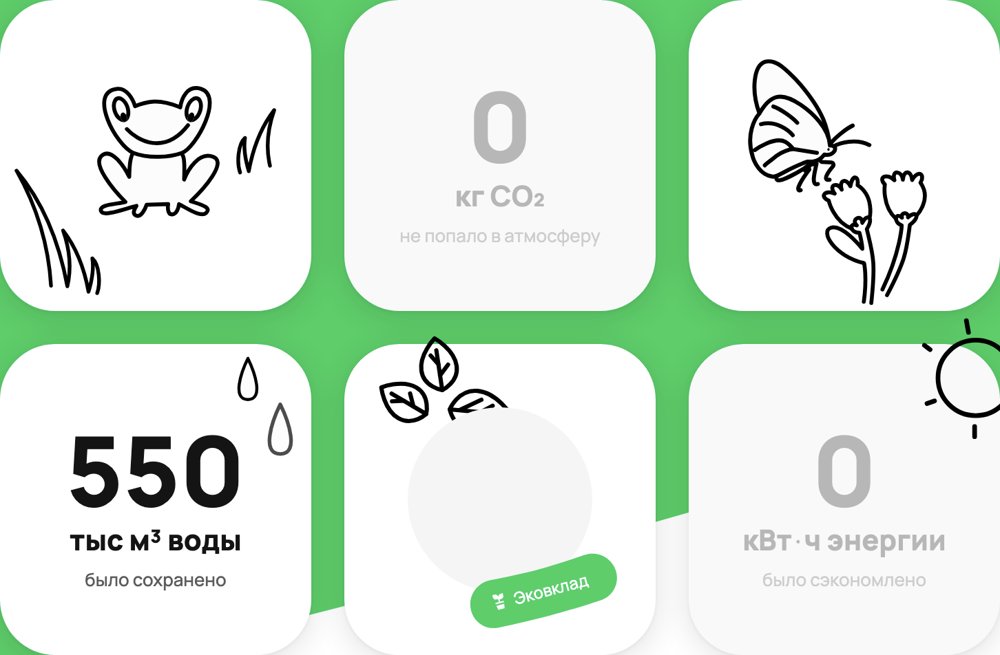

___
**ID**: 52

**Заголовок**:

Тестирование поля Water 999999998: Класс [1000000:1000000000) шаг в границу 

**Шаги**:

1. Включаем перезапись запросов в Chrome в Dev Tools
2. Настраиваем перезапись ответа от роута /web/1/charity/ecoImpact/init
на body

`{"result":{"blocks":{"personalImpact":{"data":{"co2":0,"energy":0,"water":999999998,"materials":0,"pineYears":0}}},"isAuthorized":true},"status":"ok"}`

3. Открываем страницу https://www.avito.ru/avito-care/eco-impact

**Ожидаемый результат**:

Верстка отображается корректно
В блоке Water отображается 1000 тыс м³

**Фактический результат**:

___
**ID**: 53

**Заголовок**:

Тестирование поля Water 999999999: Класс [1000000:1000000000) граничное значение и шаг за границу для класса [1000000000:1000000000000)

**Шаги**:

1. Включаем перезапись запросов в Chrome в Dev Tools
2. Настраиваем перезапись ответа от роута /web/1/charity/ecoImpact/init
на body

`{"result":{"blocks":{"personalImpact":{"data":{"co2":0,"energy":0,"water":999999999,"materials":0,"pineYears":0}}},"isAuthorized":true},"status":"ok"}`

3. Открываем страницу https://www.avito.ru/avito-care/eco-impact

**Ожидаемый результат**:

Верстка отображается корректно
В блоке Water отображается 1000 тыс м³

**Фактический результат**:

___
**ID**: 54

**Заголовок**:

Тестирование поля Water 1000000000: Класс [1000000:1000000000) шаг за границу и граничное значение для класса [1000000000:1000000000000)

**Шаги**:

1. Включаем перезапись запросов в Chrome в Dev Tools
2. Настраиваем перезапись ответа от роута /web/1/charity/ecoImpact/init
на body

`{"result":{"blocks":{"personalImpact":{"data":{"co2":0,"energy":0,"water":1000000000,"materials":0,"pineYears":0}}},"isAuthorized":true},"status":"ok"}`

3. Открываем страницу https://www.avito.ru/avito-care/eco-impact

**Ожидаемый результат**:

Верстка отображается корректно
В блоке Water отображается 1 млн м³

**Фактический результат**:

___
**ID**: 55

**Заголовок**:

Тестирование поля Water 1000000001: Шаг за границу для класса [1000000000:1000000000000)

**Шаги**:

1. Включаем перезапись запросов в Chrome в Dev Tools
2. Настраиваем перезапись ответа от роута /web/1/charity/ecoImpact/init
на body

`{"result":{"blocks":{"personalImpact":{"data":{"co2":0,"energy":0,"water":1000000001,"materials":0,"pineYears":0}}},"isAuthorized":true},"status":"ok"}`

3. Открываем страницу https://www.avito.ru/avito-care/eco-impact

**Ожидаемый результат**:

Верстка отображается корректно
В блоке Water отображается 1 млн м³

**Фактический результат**:

___
**ID**: 56

**Заголовок**:

Тестирование поля Water 550000000000: Класс [1000000000:1000000000000) типичный представитель

**Шаги**:

1. Включаем перезапись запросов в Chrome в Dev Tools
2. Настраиваем перезапись ответа от роута /web/1/charity/ecoImpact/init
на body

`{"result":{"blocks":{"personalImpact":{"data":{"co2":0,"energy":0,"water":550000000000,"materials":0,"pineYears":0}}},"isAuthorized":true},"status":"ok"}`

3. Открываем страницу https://www.avito.ru/avito-care/eco-impact

**Ожидаемый результат**:

Верстка отображается корректно
В блоке Water отображается 550 млн м³

**Фактический результат**:

___
**ID**: 57

**Заголовок**:

Тестирование поля Water 999999999998: Класс [1000000000:1000000000000) шаг в границу 

**Шаги**:

1. Включаем перезапись запросов в Chrome в Dev Tools
2. Настраиваем перезапись ответа от роута /web/1/charity/ecoImpact/init
на body

`{"result":{"blocks":{"personalImpact":{"data":{"co2":0,"energy":0,"water":999999999998,"materials":0,"pineYears":0}}},"isAuthorized":true},"status":"ok"}`

3. Открываем страницу https://www.avito.ru/avito-care/eco-impact

**Ожидаемый результат**:

Верстка отображается корректно
В блоке Water отображается 1000 млн м³

**Фактический результат**:

___
**ID**: 58

**Заголовок**:

Тестирование поля Water 999999999999: Класс [1000000000:1000000000000) граничное значение и шаг за границу для класса [1000000000000:1000000000000000)

**Шаги**:

1. Включаем перезапись запросов в Chrome в Dev Tools
2. Настраиваем перезапись ответа от роута /web/1/charity/ecoImpact/init
на body

`{"result":{"blocks":{"personalImpact":{"data":{"co2":0,"energy":0,"water":999999999999,"materials":0,"pineYears":0}}},"isAuthorized":true},"status":"ok"}`

3. Открываем страницу https://www.avito.ru/avito-care/eco-impact

**Ожидаемый результат**:

Верстка отображается корректно
В блоке Water отображается 1000 млн м³

**Фактический результат**:

___
**ID**: 59

**Заголовок**:

Тестирование поля Water 1000000000000: Класс [1000000000:1000000000000) шаг за границу и граничное значение для класса [1000000000000:1000000000000000)

**Шаги**:

1. Включаем перезапись запросов в Chrome в Dev Tools
2. Настраиваем перезапись ответа от роута /web/1/charity/ecoImpact/init
на body

`{"result":{"blocks":{"personalImpact":{"data":{"co2":0,"energy":0,"water":1000000000000,"materials":0,"pineYears":0}}},"isAuthorized":true},"status":"ok"}`

3. Открываем страницу https://www.avito.ru/avito-care/eco-impact

**Ожидаемый результат**:

Верстка отображается корректно
В блоке Water отображается 1 млрд м³

**Фактический результат**:

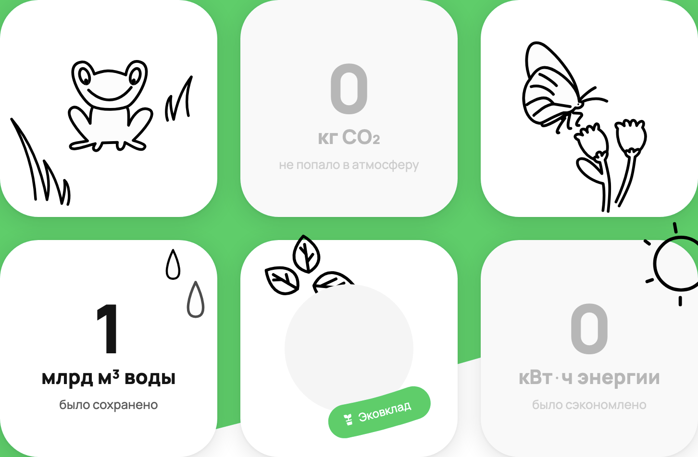

___
**ID**: 60

**Заголовок**:

Тестирование поля Water 1000000000001: Шаг за границу для класса [1000000000000:1000000000000000)

**Шаги**:

1. Включаем перезапись запросов в Chrome в Dev Tools
2. Настраиваем перезапись ответа от роута /web/1/charity/ecoImpact/init
на body

`{"result":{"blocks":{"personalImpact":{"data":{"co2":0,"energy":0,"water":1000000000001,"materials":0,"pineYears":0}}},"isAuthorized":true},"status":"ok"}`

3. Открываем страницу https://www.avito.ru/avito-care/eco-impact

**Ожидаемый результат**:

Верстка отображается корректно
В блоке Water отображается 1 млрд м³

**Фактический результат**:

___
**ID**: 61

**Заголовок**:

Тестирование поля Water 550000000000000: Класс [1000000000000:1000000000000000)типичный представитель

**Шаги**:

1. Включаем перезапись запросов в Chrome в Dev Tools
2. Настраиваем перезапись ответа от роута /web/1/charity/ecoImpact/init
на body

`{"result":{"blocks":{"personalImpact":{"data":{"co2":0,"energy":0,"water":550000000000000,"materials":0,"pineYears":0}}},"isAuthorized":true},"status":"ok"}`

3. Открываем страницу https://www.avito.ru/avito-care/eco-impact

**Ожидаемый результат**:

Верстка отображается корректно
В блоке Water отображается 550 млрд м³

**Фактический результат**:

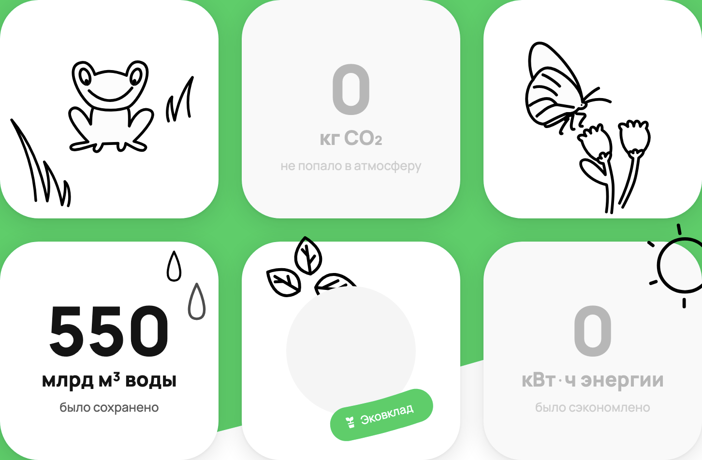

___
**ID**: 62

**Заголовок**:

Тестирование поля Water 999999999999998: Класс [1000000000000:1000000000000000) шаг в границу 

**Шаги**:

1. Включаем перезапись запросов в Chrome в Dev Tools
2. Настраиваем перезапись ответа от роута /web/1/charity/ecoImpact/init
на body

`{"result":{"blocks":{"personalImpact":{"data":{"co2":0,"energy":0,"water":999999999999998,"materials":0,"pineYears":0}}},"isAuthorized":true},"status":"ok"}`

3. Открываем страницу https://www.avito.ru/avito-care/eco-impact

**Ожидаемый результат**:

Верстка отображается корректно
В блоке Water отображается 1000 млрд м³

**Фактический результат**:

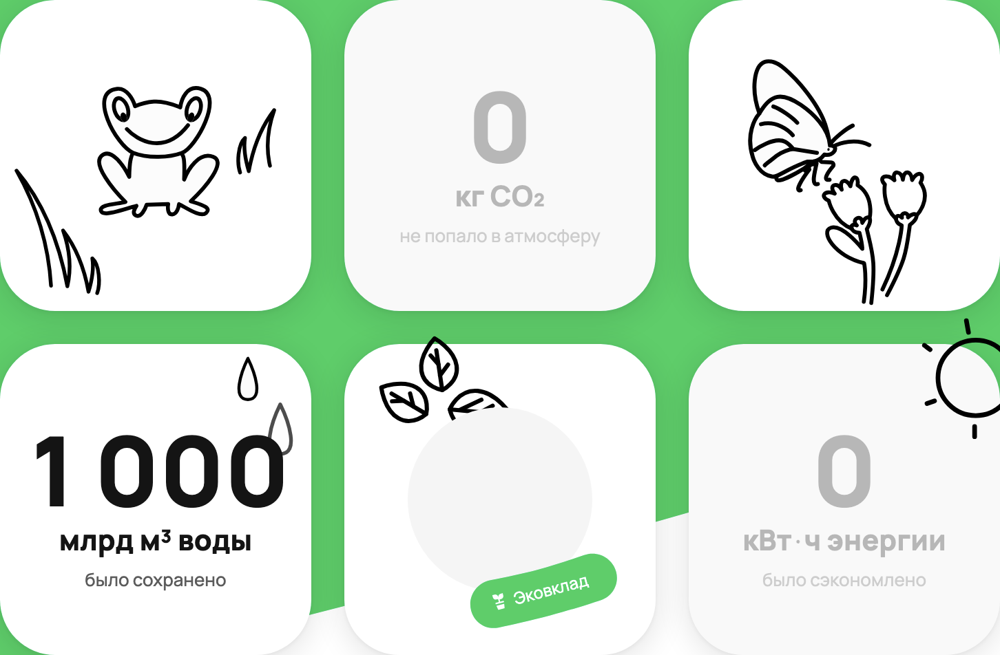

___
**ID**: 63

**Заголовок**:

Тестирование поля Water 999999999999999: Класс [1000000000000:1000000000000000) граничное значение и шаг за границу для класса [1000000000000000:1000000000000000000)

**Шаги**:

1. Включаем перезапись запросов в Chrome в Dev Tools
2. Настраиваем перезапись ответа от роута /web/1/charity/ecoImpact/init
на body

`{"result":{"blocks":{"personalImpact":{"data":{"co2":0,"energy":0,"water":999999999999999,"materials":0,"pineYears":0}}},"isAuthorized":true},"status":"ok"}`

3. Открываем страницу https://www.avito.ru/avito-care/eco-impact

**Ожидаемый результат**:

Верстка отображается корректно
В блоке Water отображается 1000 млрд м³

**Фактический результат**:

___
**ID**: 64

**Заголовок**:

Тестирование поля Water 1000000000000000: Класс [1000000000000:1000000000000000) шаг за границу и граничное значение для класса [1000000000000000:1000000000000000000)

**Шаги**:

1. Включаем перезапись запросов в Chrome в Dev Tools
2. Настраиваем перезапись ответа от роута /web/1/charity/ecoImpact/init
на body

`{"result":{"blocks":{"personalImpact":{"data":{"co2":0,"energy":0,"water":1000000000000000,"materials":0,"pineYears":0}}},"isAuthorized":true},"status":"ok"}`

3. Открываем страницу https://www.avito.ru/avito-care/eco-impact

**Ожидаемый результат**:

Верстка отображается корректно
В блоке Water отображается 1 трлн м³

**Фактический результат**:

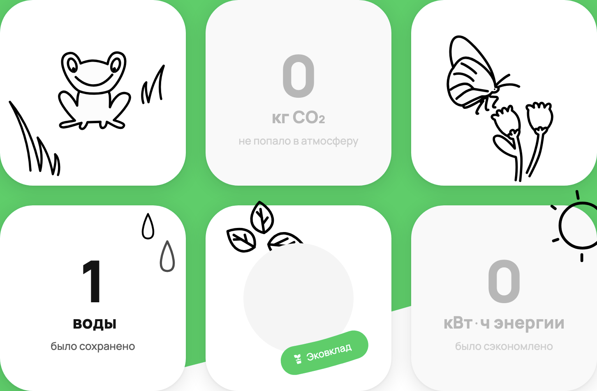

**Ссылка на баг-репорт**

[ID: BR17](BUGS.md)
___
**ID**: 65

**Заголовок**:

Тестирование поля Water 1000000000000001: Шаг за границу для класса [1000000000000000:1000000000000000000)

**Шаги**:

1. Включаем перезапись запросов в Chrome в Dev Tools
2. Настраиваем перезапись ответа от роута /web/1/charity/ecoImpact/init
на body

`{"result":{"blocks":{"personalImpact":{"data":{"co2":0,"energy":0,"water":1000000000000001,"materials":0,"pineYears":0}}},"isAuthorized":true},"status":"ok"}`

3. Открываем страницу https://www.avito.ru/avito-care/eco-impact

**Ожидаемый результат**:

Верстка отображается корректно
В блоке Water отображается 1 трлн м³

**Фактический результат**:

**Ссылка на баг-репорт**

[ID: BR18](BUGS.md)
___
**ID**: 66

**Заголовок**:

Тестирование поля Water число 576 строкой: Проверка на класс эквивалентности число строкой

**Шаги**:

1. Включаем перезапись запросов в Chrome в Dev Tools
2. Настраиваем перезапись ответа от роута /web/1/charity/ecoImpact/init
на body

`{"result":{"blocks":{"personalImpact":{"data":{"co2":0,"energy":0,"water":"576","materials":0,"pineYears":0}}},"isAuthorized":true},"status":"ok"}`

3. Открываем страницу https://www.avito.ru/avito-care/eco-impact

**Ожидаемый результат**:

Верстка отображается корректно
В блоке Water отображается 0 л

**Фактический результат**:

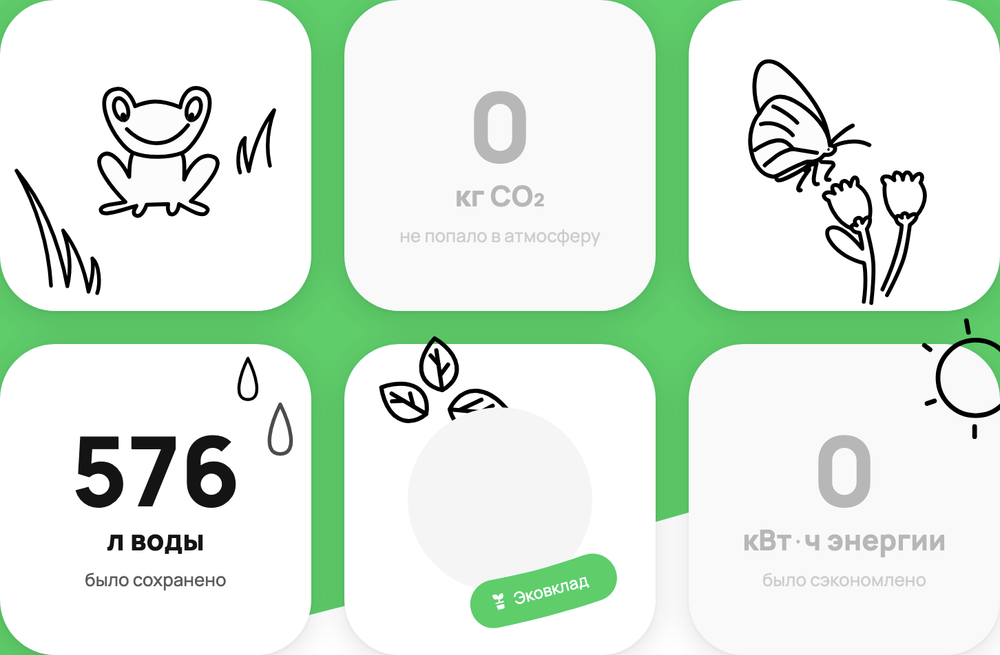

**Ссылка на баг-репорт**

[ID: BR19](BUGS.md)
___
**ID**: 67

**Заголовок**:

Тестирование поля Water дробное число 11.6: Проверка на класс эквивалентности число строкой

**Шаги**:

1. Включаем перезапись запросов в Chrome в Dev Tools
2. Настраиваем перезапись ответа от роута /web/1/charity/ecoImpact/init
на body

`{"result":{"blocks":{"personalImpact":{"data":{"co2":0,"energy":0,"water":11.6,"materials":0,"pineYears":0}}},"isAuthorized":true},"status":"ok"}`

3. Открываем страницу https://www.avito.ru/avito-care/eco-impact

**Ожидаемый результат**:

Верстка отображается корректно
В блоке Water отображается 12 л

**Фактический результат**:

___
**ID**: 68

**Заголовок**:

Тестирование поля Water null вместо числа: Проверка на класс эквивалентности null

**Шаги**:

1. Включаем перезапись запросов в Chrome в Dev Tools
2. Настраиваем перезапись ответа от роута /web/1/charity/ecoImpact/init
на body

`{"result":{"blocks":{"personalImpact":{"data":{"co2":0,"energy":0,"water":null,"materials":0,"pineYears":0}}},"isAuthorized":true},"status":"ok"}`

3. Открываем страницу https://www.avito.ru/avito-care/eco-impact

**Ожидаемый результат**:

Верстка отображается корректно
В блоке Water отображается 0 л

**Фактический результат**:

___
**ID**: 69

**Заголовок**:

Тестирование поля Water @ вместо числа: Проверка на класс эквивалентности спецсимвол

**Шаги**:

1. Включаем перезапись запросов в Chrome в Dev Tools
2. Настраиваем перезапись ответа от роута /web/1/charity/ecoImpact/init
на body

`{"result":{"blocks":{"personalImpact":{"data":{"co2":0,"energy":0,"water":"@","materials":0,"pineYears":0}}},"isAuthorized":true},"status":"ok"}`

3. Открываем страницу https://www.avito.ru/avito-care/eco-impact

**Ожидаемый результат**:

Верстка отображается корректно
В блоке Water отображается 0 л

**Фактический результат**:

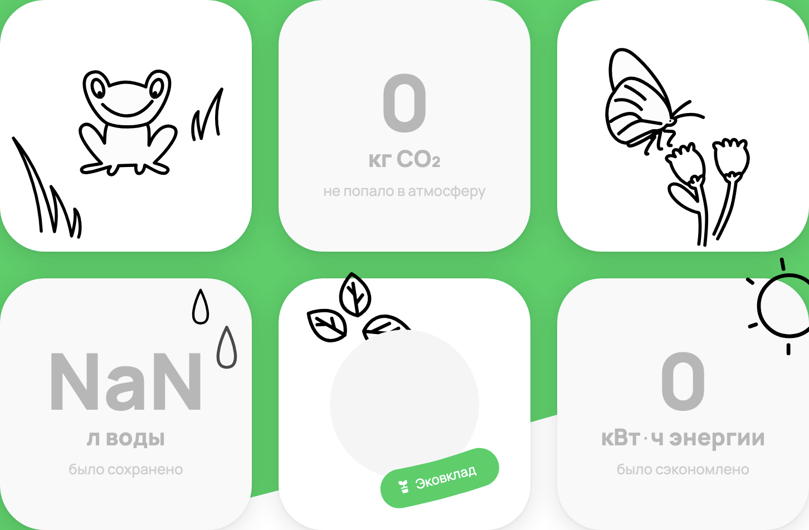

**Ссылка на баг-репорт**

[ID: BR20](BUGS.md)
___
**ID**: 70

**Заголовок**:

Тестирование поля Water строка abc вместо числа: Проверка на класс эквивалентности буквы

**Шаги**:

1. Включаем перезапись запросов в Chrome в Dev Tools
2. Настраиваем перезапись ответа от роута /web/1/charity/ecoImpact/init
на body

`{"result":{"blocks":{"personalImpact":{"data":{"co2":0,"energy":0,"water":"abc","materials":0,"pineYears":0}}},"isAuthorized":true},"status":"ok"}`

3. Открываем страницу https://www.avito.ru/avito-care/eco-impact

**Ожидаемый результат**:

Верстка отображается корректно
В блоке Water отображается 0 л

**Фактический результат**:

**Ссылка на баг-репорт**

[ID: BR21](BUGS.md)
___
**ID**: 71

**Заголовок**:

Тестирование поля Energy -500: Класс (-∞:-1] типичный представитель

**Шаги**:

1. Включаем перезапись запросов в Chrome в Dev Tools
2. Настраиваем перезапись ответа от роута /web/1/charity/ecoImpact/init
на body

`{"result":{"blocks":{"personalImpact":{"data":{"co2":0,"energy":-500,"water":0,"materials":0,"pineYears":0}}},"isAuthorized":true},"status":"ok"}`

3. Открываем страницу https://www.avito.ru/avito-care/eco-impact

**Ожидаемый результат**:

Верстка отображается корректно
В блоке Energy отображается 0 кВт*ч

**Фактический результат**:

**Ссылка на баг-репорт**

[ID: BR22](BUGS.md)
___
**ID**: 72

**Заголовок**:

Тестирование поля Energy -2: Класс (-∞:-1] шаг в границу

**Шаги**:

1. Включаем перезапись запросов в Chrome в Dev Tools
2. Настраиваем перезапись ответа от роута /web/1/charity/ecoImpact/init
на body

`{"result":{"blocks":{"personalImpact":{"data":{"co2":0,"energy":-2,"water":0,"materials":0,"pineYears":0}}},"isAuthorized":true},"status":"ok"}`

3. Открываем страницу https://www.avito.ru/avito-care/eco-impact

**Ожидаемый результат**:

Верстка отображается корректно
В блоке Energy отображается 0 кВт*ч

**Фактический результат**:

**Ссылка на баг-репорт**

[ID: BR23](BUGS.md)
___
**ID**: 73

**Заголовок**:

Тестирование поля Energy -1: Класс (-∞:-1] граничное значение и шаг за границу для класса [0:1000)

**Шаги**:

1. Включаем перезапись запросов в Chrome в Dev Tools
2. Настраиваем перезапись ответа от роута /web/1/charity/ecoImpact/init
на body

`{"result":{"blocks":{"personalImpact":{"data":{"co2":0,"energy":-1,"water":0,"materials":0,"pineYears":0}}},"isAuthorized":true},"status":"ok"}`

3. Открываем страницу https://www.avito.ru/avito-care/eco-impact

**Ожидаемый результат**:

Верстка отображается корректно
В блоке Energy отображается 0 кВт*ч

**Фактический результат**:

**Ссылка на баг-репорт**

[ID: BR24](BUGS.md)
___
**ID**: 74

**Заголовок**:

Тестирование поля Energy 0: Класс (-∞:-1] шаг за границу и граничное значение для класса [0:1000)

**Шаги**:

1. Включаем перезапись запросов в Chrome в Dev Tools
2. Настраиваем перезапись ответа от роута /web/1/charity/ecoImpact/init
на body

`{"result":{"blocks":{"personalImpact":{"data":{"co2":0,"energy":0,"water":0,"materials":0,"pineYears":0}}},"isAuthorized":true},"status":"ok"}`

3. Открываем страницу https://www.avito.ru/avito-care/eco-impact

**Ожидаемый результат**:

Верстка отображается корректно
В блоке Energy отображается 0 кВт*ч

**Фактический результат**:

___
**ID**: 75

**Заголовок**:

Тестирование поля Energy 1: Шаг за границу для класса [0:1000)

**Шаги**:

1. Включаем перезапись запросов в Chrome в Dev Tools
2. Настраиваем перезапись ответа от роута /web/1/charity/ecoImpact/init
на body

`{"result":{"blocks":{"personalImpact":{"data":{"co2":0,"energy":1,"water":0,"materials":0,"pineYears":0}}},"isAuthorized":true},"status":"ok"}`

3. Открываем страницу https://www.avito.ru/avito-care/eco-impact

**Ожидаемый результат**:

Верстка отображается корректно
В блоке Energy отображается 1 кВт*ч

**Фактический результат**:

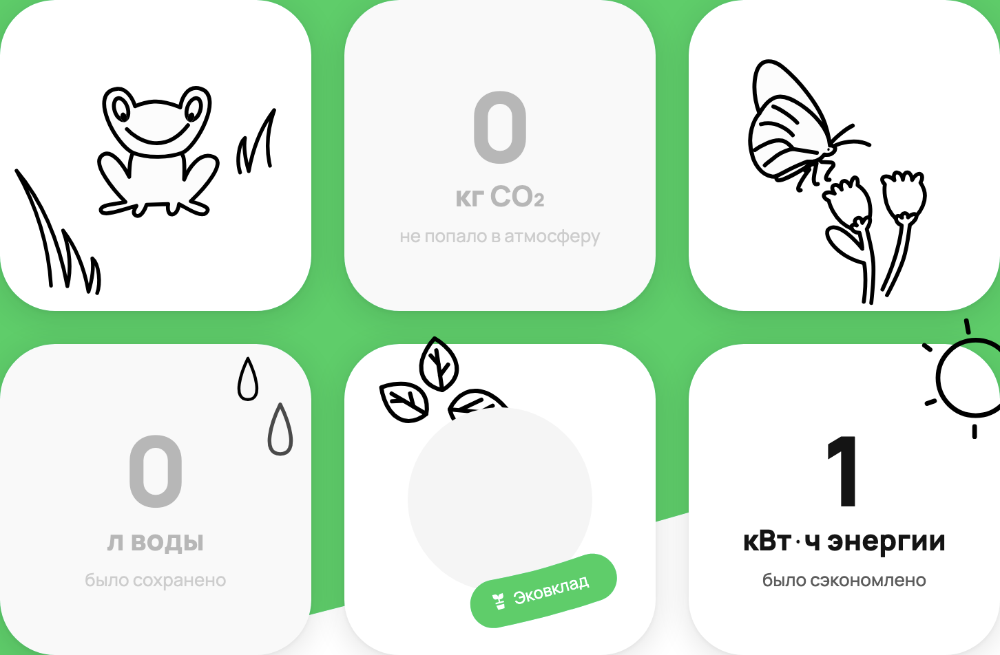

___
**ID**: 76

**Заголовок**:

Тестирование поля Energy 500: Класс [0:1000) типичный представитель

**Шаги**:

1. Включаем перезапись запросов в Chrome в Dev Tools
2. Настраиваем перезапись ответа от роута /web/1/charity/ecoImpact/init
на body

`{"result":{"blocks":{"personalImpact":{"data":{"co2":0,"energy":500,"water":0,"materials":0,"pineYears":0}}},"isAuthorized":true},"status":"ok"}`

3. Открываем страницу https://www.avito.ru/avito-care/eco-impact

**Ожидаемый результат**:

Верстка отображается корректно
В блоке Energy отображается 500 кВт*ч

**Фактический результат**:

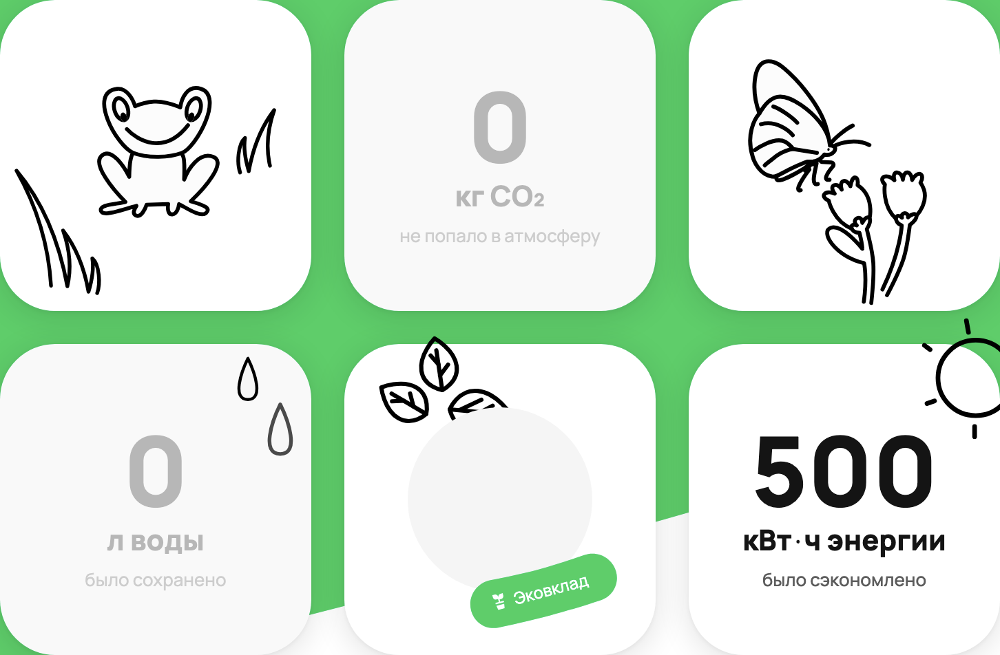

___
**ID**: 77

**Заголовок**:

Тестирование поля Energy 998: Класс [0:1000) шаг в границу 

**Шаги**:

1. Включаем перезапись запросов в Chrome в Dev Tools
2. Настраиваем перезапись ответа от роута /web/1/charity/ecoImpact/init
на body

`{"result":{"blocks":{"personalImpact":{"data":{"co2":0,"energy":998,"water":0,"materials":0,"pineYears":0}}},"isAuthorized":true},"status":"ok"}`

3. Открываем страницу https://www.avito.ru/avito-care/eco-impact

**Ожидаемый результат**:

Верстка отображается корректно
В блоке Energy отображается 998 кВт*ч

**Фактический результат**:

___
**ID**: 78

**Заголовок**:

Тестирование поля Energy 999: Класс [0:1000) граничное значение и шаг за границу для класса [1000:1000000)

**Шаги**:

1. Включаем перезапись запросов в Chrome в Dev Tools
2. Настраиваем перезапись ответа от роута /web/1/charity/ecoImpact/init
на body

`{"result":{"blocks":{"personalImpact":{"data":{"co2":0,"energy":999,"water":0,"materials":0,"pineYears":0}}},"isAuthorized":true},"status":"ok"}`

3. Открываем страницу https://www.avito.ru/avito-care/eco-impact

**Ожидаемый результат**:

Верстка отображается корректно
В блоке Energy отображается 999 кВт*ч

**Фактический результат**:

___
**ID**: 79

**Заголовок**:

Тестирование поля Energy 1000: Класс [0:1000) шаг за границу и граничное значение для класса [1000:1000000)

**Шаги**:

1. Включаем перезапись запросов в Chrome в Dev Tools
2. Настраиваем перезапись ответа от роута /web/1/charity/ecoImpact/init
на body

`{"result":{"blocks":{"personalImpact":{"data":{"co2":0,"energy":1000,"water":0,"materials":0,"pineYears":0}}},"isAuthorized":true},"status":"ok"}`

3. Открываем страницу https://www.avito.ru/avito-care/eco-impact

**Ожидаемый результат**:

Верстка отображается корректно
В блоке Energy отображается 1 МВт*ч

**Фактический результат**:

___
**ID**: 80

**Заголовок**:

Тестирование поля Energy 1001: Шаг за границу для класса [1000:1000000)

**Шаги**:

1. Включаем перезапись запросов в Chrome в Dev Tools
2. Настраиваем перезапись ответа от роута /web/1/charity/ecoImpact/init
на body

`{"result":{"blocks":{"personalImpact":{"data":{"co2":0,"energy":1001,"water":0,"materials":0,"pineYears":0}}},"isAuthorized":true},"status":"ok"}`

3. Открываем страницу https://www.avito.ru/avito-care/eco-impact

**Ожидаемый результат**:

Верстка отображается корректно
В блоке Energy отображается 1 МВт*ч

**Фактический результат**:

___
**ID**: 81

**Заголовок**:

Тестирование поля Energy 550000: Класс [1000:1000000) типичный представитель

**Шаги**:

1. Включаем перезапись запросов в Chrome в Dev Tools
2. Настраиваем перезапись ответа от роута /web/1/charity/ecoImpact/init
на body

`{"result":{"blocks":{"personalImpact":{"data":{"co2":0,"energy":550000,"water":0,"materials":0,"pineYears":0}}},"isAuthorized":true},"status":"ok"}`

3. Открываем страницу https://www.avito.ru/avito-care/eco-impact

**Ожидаемый результат**:

Верстка отображается корректно
В блоке Energy отображается 550 МВт*ч

**Фактический результат**:

___
**ID**: 82

**Заголовок**:

Тестирование поля Energy 999998: Класс [1000:1000000) шаг в границу 

**Шаги**:

1. Включаем перезапись запросов в Chrome в Dev Tools
2. Настраиваем перезапись ответа от роута /web/1/charity/ecoImpact/init
на body

`{"result":{"blocks":{"personalImpact":{"data":{"co2":0,"energy":999998,"water":0,"materials":0,"pineYears":0}}},"isAuthorized":true},"status":"ok"}`

3. Открываем страницу https://www.avito.ru/avito-care/eco-impact

**Ожидаемый результат**:

Верстка отображается корректно
В блоке Energy отображается 1000 МВт*ч

**Фактический результат**:

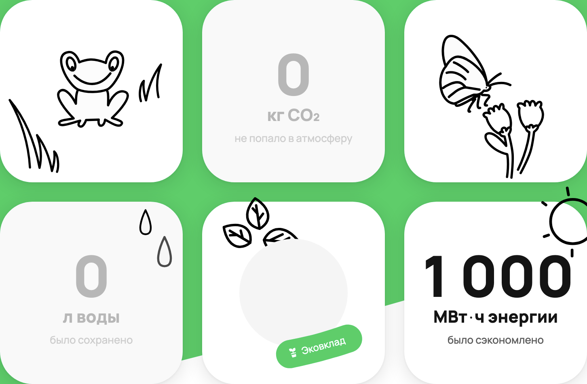

___
**ID**: 83

**Заголовок**:

Тестирование поля Energy 999999: Класс [1000:1000000) граничное значение и шаг за границу для класса [1000000:1000000000)

**Шаги**:

1. Включаем перезапись запросов в Chrome в Dev Tools
2. Настраиваем перезапись ответа от роута /web/1/charity/ecoImpact/init
на body

`{"result":{"blocks":{"personalImpact":{"data":{"co2":0,"energy":999999,"water":0,"materials":0,"pineYears":0}}},"isAuthorized":true},"status":"ok"}`

3. Открываем страницу https://www.avito.ru/avito-care/eco-impact

**Ожидаемый результат**:

Верстка отображается корректно
В блоке Energy отображается 1000 МВт*ч

**Фактический результат**:

___
**ID**: 84

**Заголовок**:

Тестирование поля Energy 1000000: Класс [1000:1000000) шаг за границу и граничное значение для класса [1000000:1000000000)

**Шаги**:

1. Включаем перезапись запросов в Chrome в Dev Tools
2. Настраиваем перезапись ответа от роута /web/1/charity/ecoImpact/init
на body

`{"result":{"blocks":{"personalImpact":{"data":{"co2":0,"energy":1000000,"water":0,"materials":0,"pineYears":0}}},"isAuthorized":true},"status":"ok"}`

3. Открываем страницу https://www.avito.ru/avito-care/eco-impact

**Ожидаемый результат**:

Верстка отображается корректно
В блоке Energy отображается 1 тыс МВт*ч

**Фактический результат**:

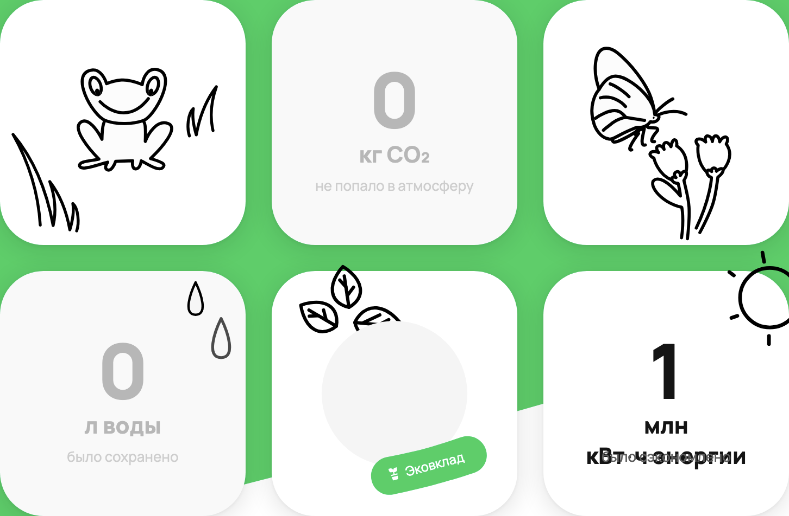

**Ссылка на баг-репорт**

[ID: BR25](BUGS.md)
[ID: BR26](BUGS.md)
___
**ID**: 85

**Заголовок**:

Тестирование поля Energy 1000001: Шаг за границу для класса [1000000:1000000000)

**Шаги**:

1. Включаем перезапись запросов в Chrome в Dev Tools
2. Настраиваем перезапись ответа от роута /web/1/charity/ecoImpact/init
на body

`{"result":{"blocks":{"personalImpact":{"data":{"co2":0,"energy":1000001,"water":0,"materials":0,"pineYears":0}}},"isAuthorized":true},"status":"ok"}`

3. Открываем страницу https://www.avito.ru/avito-care/eco-impact

**Ожидаемый результат**:

Верстка отображается корректно
В блоке Energy отображается 1 тыс МВт*ч

**Фактический результат**:

**Ссылка на баг-репорт**

[ID: BR27](BUGS.md)
[ID: BR28](BUGS.md)
___
**ID**: 86

**Заголовок**:

Тестирование поля Energy 550000000: Класс [1000000:1000000000) типичный представитель

**Шаги**:

1. Включаем перезапись запросов в Chrome в Dev Tools
2. Настраиваем перезапись ответа от роута /web/1/charity/ecoImpact/init
на body

`{"result":{"blocks":{"personalImpact":{"data":{"co2":0,"energy":550000000,"water":0,"materials":0,"pineYears":0}}},"isAuthorized":true},"status":"ok"}`

3. Открываем страницу https://www.avito.ru/avito-care/eco-impact

**Ожидаемый результат**:

Верстка отображается корректно
В блоке Energy отображается 550 тыс МВт*ч

**Фактический результат**:

**Ссылка на баг-репорт**

[ID: BR29](BUGS.md)
[ID: BR30](BUGS.md)
___
**ID**: 87

**Заголовок**:

Тестирование поля Energy 999999998: Класс [1000000:1000000000) шаг в границу 

**Шаги**:

1. Включаем перезапись запросов в Chrome в Dev Tools
2. Настраиваем перезапись ответа от роута /web/1/charity/ecoImpact/init
на body

`{"result":{"blocks":{"personalImpact":{"data":{"co2":0,"energy":999999998,"water":0,"materials":0,"pineYears":0}}},"isAuthorized":true},"status":"ok"}`

3. Открываем страницу https://www.avito.ru/avito-care/eco-impact

**Ожидаемый результат**:

Верстка отображается корректно
В блоке Energy отображается 1000 тыс МВт*ч

**Фактический результат**:

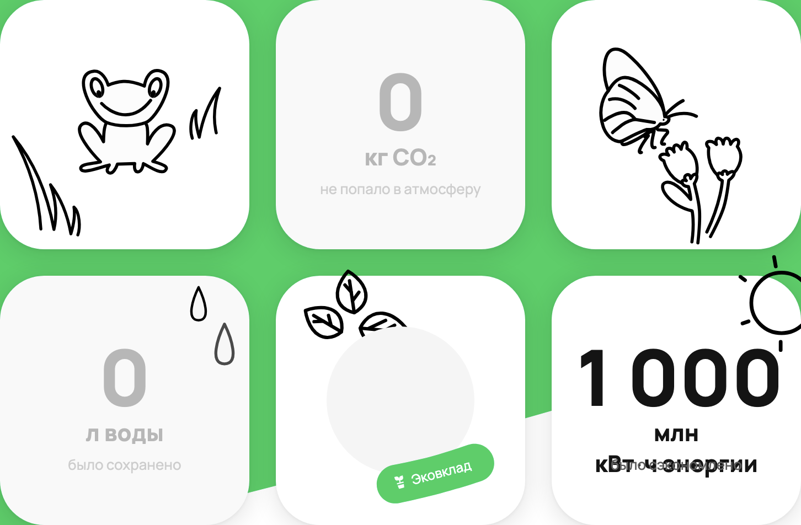

**Ссылка на баг-репорт**

[ID: BR31](BUGS.md)
[ID: BR32](BUGS.md)

___
**ID**: 88

**Заголовок**:

Тестирование поля Energy 999999999: Класс [1000000:1000000000) граничное значение и шаг за границу для класса [1000000000:1000000000000)

**Шаги**:

1. Включаем перезапись запросов в Chrome в Dev Tools
2. Настраиваем перезапись ответа от роута /web/1/charity/ecoImpact/init
на body

`{"result":{"blocks":{"personalImpact":{"data":{"co2":0,"energy":999999999,"water":0,"materials":0,"pineYears":0}}},"isAuthorized":true},"status":"ok"}`

3. Открываем страницу https://www.avito.ru/avito-care/eco-impact

**Ожидаемый результат**:

Верстка отображается корректно
В блоке Energy отображается 1000 тыс МВт*ч

**Фактический результат**:

**Ссылка на баг-репорт**

[ID: BR33](BUGS.md)
[ID: BR34](BUGS.md)

___
**ID**: 89

**Заголовок**:

Тестирование поля Energy 1000000000: Класс [1000000:1000000000) шаг за границу и граничное значение для класса [1000000000:1000000000000)

**Шаги**:

1. Включаем перезапись запросов в Chrome в Dev Tools
2. Настраиваем перезапись ответа от роута /web/1/charity/ecoImpact/init
на body

`{"result":{"blocks":{"personalImpact":{"data":{"co2":0,"energy":1000000000,"water":0,"materials":0,"pineYears":0}}},"isAuthorized":true},"status":"ok"}`

3. Открываем страницу https://www.avito.ru/avito-care/eco-impact

**Ожидаемый результат**:

Верстка отображается корректно
В блоке Energy отображается 1 млн МВт*ч

**Фактический результат**:

**Ссылка на баг-репорт**

[ID: BR35](BUGS.md)
___
**ID**: 90

**Заголовок**:

Тестирование поля Energy 1000000001: Шаг за границу для класса [1000000000:1000000000000)

**Шаги**:

1. Включаем перезапись запросов в Chrome в Dev Tools
2. Настраиваем перезапись ответа от роута /web/1/charity/ecoImpact/init
на body

`{"result":{"blocks":{"personalImpact":{"data":{"co2":0,"energy":1000000001,"water":0,"materials":0,"pineYears":0}}},"isAuthorized":true},"status":"ok"}`

3. Открываем страницу https://www.avito.ru/avito-care/eco-impact

**Ожидаемый результат**:

Верстка отображается корректно
В блоке Energy отображается 1 млн МВт*ч

**Фактический результат**:

**Ссылка на баг-репорт**

[ID: BR36](BUGS.md)

___
**ID**: 91

**Заголовок**:

Тестирование поля Energy 550000000000: Класс [1000000000:1000000000000) типичный представитель

**Шаги**:

1. Включаем перезапись запросов в Chrome в Dev Tools
2. Настраиваем перезапись ответа от роута /web/1/charity/ecoImpact/init
на body

`{"result":{"blocks":{"personalImpact":{"data":{"co2":0,"energy":550000000000,"water":0,"materials":0,"pineYears":0}}},"isAuthorized":true},"status":"ok"}`

3. Открываем страницу https://www.avito.ru/avito-care/eco-impact

**Ожидаемый результат**:

Верстка отображается корректно
В блоке Energy отображается 550 млн МВт*ч

**Фактический результат**:

**Ссылка на баг-репорт**

[ID: BR37](BUGS.md)

___
**ID**: 92

**Заголовок**:

Тестирование поля Energy 999999999998: Класс [1000000000:1000000000000) шаг в границу 

**Шаги**:

1. Включаем перезапись запросов в Chrome в Dev Tools
2. Настраиваем перезапись ответа от роута /web/1/charity/ecoImpact/init
на body

`{"result":{"blocks":{"personalImpact":{"data":{"co2":0,"energy":999999999998,"water":0,"materials":0,"pineYears":0}}},"isAuthorized":true},"status":"ok"}`

3. Открываем страницу https://www.avito.ru/avito-care/eco-impact

**Ожидаемый результат**:

Верстка отображается корректно
В блоке Energy отображается 1000 млн МВт*ч

**Фактический результат**:

**Ссылка на баг-репорт**

[ID: BR38](BUGS.md)

___
**ID**: 93

**Заголовок**:

Тестирование поля Energy 999999999999: Класс [1000000000:1000000000000) граничное значение и шаг за границу для класса [1000000000000:1000000000000000)

**Шаги**:

1. Включаем перезапись запросов в Chrome в Dev Tools
2. Настраиваем перезапись ответа от роута /web/1/charity/ecoImpact/init
на body

`{"result":{"blocks":{"personalImpact":{"data":{"co2":0,"energy":999999999999,"water":0,"materials":0,"pineYears":0}}},"isAuthorized":true},"status":"ok"}`

3. Открываем страницу https://www.avito.ru/avito-care/eco-impact

**Ожидаемый результат**:

Верстка отображается корректно
В блоке Energy отображается 1000 млн МВт*ч

**Фактический результат**:

**Ссылка на баг-репорт**

[ID: BR39](BUGS.md)

___
**ID**: 94

**Заголовок**:

Тестирование поля Energy 1000000000000: Класс [1000000000:1000000000000) шаг за границу и граничное значение для класса [1000000000000:1000000000000000)

**Шаги**:

1. Включаем перезапись запросов в Chrome в Dev Tools
2. Настраиваем перезапись ответа от роута /web/1/charity/ecoImpact/init
на body

`{"result":{"blocks":{"personalImpact":{"data":{"co2":0,"energy":1000000000000,"water":0,"materials":0,"pineYears":0}}},"isAuthorized":true},"status":"ok"}`

3. Открываем страницу https://www.avito.ru/avito-care/eco-impact

**Ожидаемый результат**:

Верстка отображается корректно
В блоке Energy отображается 1 млрд МВт*ч

**Фактический результат**:

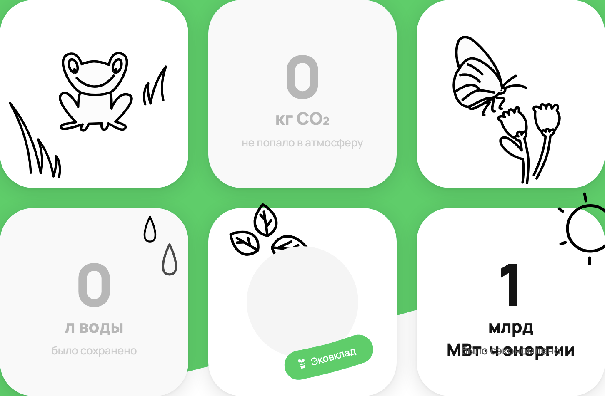

**Ссылка на баг-репорт**

[ID: BR40](BUGS.md)

___
**ID**: 95

**Заголовок**:

Тестирование поля Energy 1000000000001: Шаг за границу для класса [1000000000000:1000000000000000)

**Шаги**:

1. Включаем перезапись запросов в Chrome в Dev Tools
2. Настраиваем перезапись ответа от роута /web/1/charity/ecoImpact/init
на body

`{"result":{"blocks":{"personalImpact":{"data":{"co2":0,"energy":1000000000001,"water":0,"materials":0,"pineYears":0}}},"isAuthorized":true},"status":"ok"}`

3. Открываем страницу https://www.avito.ru/avito-care/eco-impact

**Ожидаемый результат**:

Верстка отображается корректно
В блоке Energy отображается 1 млрд МВт*ч

**Фактический результат**:

**Ссылка на баг-репорт**

[ID: BR41](BUGS.md)

___
**ID**: 96

**Заголовок**:

Тестирование поля Energy 550000000000000: Класс [1000000000000:1000000000000000)типичный представитель

**Шаги**:

1. Включаем перезапись запросов в Chrome в Dev Tools
2. Настраиваем перезапись ответа от роута /web/1/charity/ecoImpact/init
на body

`{"result":{"blocks":{"personalImpact":{"data":{"co2":0,"energy":550000000000000,"water":0,"materials":0,"pineYears":0}}},"isAuthorized":true},"status":"ok"}`

3. Открываем страницу https://www.avito.ru/avito-care/eco-impact

**Ожидаемый результат**:

Верстка отображается корректно
В блоке Energy отображается 550 млрд МВт*ч

**Фактический результат**:

**Ссылка на баг-репорт**

[ID: BR42](BUGS.md)

___
**ID**: 97

**Заголовок**:

Тестирование поля Energy 999999999999998: Класс [1000000000000:1000000000000000) шаг в границу 

**Шаги**:

1. Включаем перезапись запросов в Chrome в Dev Tools
2. Настраиваем перезапись ответа от роута /web/1/charity/ecoImpact/init
на body

`{"result":{"blocks":{"personalImpact":{"data":{"co2":0,"energy":999999999999998,"water":0,"materials":0,"pineYears":0}}},"isAuthorized":true},"status":"ok"}`

3. Открываем страницу https://www.avito.ru/avito-care/eco-impact

**Ожидаемый результат**:

Верстка отображается корректно
В блоке Energy отображается 1000 млрд МВт*ч

**Фактический результат**:

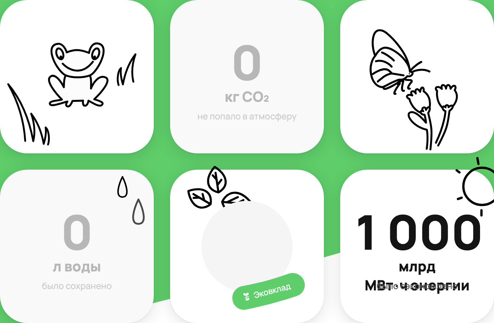

**Ссылка на баг-репорт**

[ID: BR43](BUGS.md)

___
**ID**: 98

**Заголовок**:

Тестирование поля Energy 999999999999999: Класс [1000000000000:1000000000000000) граничное значение и шаг за границу для класса [1000000000000000:1000000000000000000)

**Шаги**:

1. Включаем перезапись запросов в Chrome в Dev Tools
2. Настраиваем перезапись ответа от роута /web/1/charity/ecoImpact/init
на body

`{"result":{"blocks":{"personalImpact":{"data":{"co2":0,"energy":999999999999999,"water":0,"materials":0,"pineYears":0}}},"isAuthorized":true},"status":"ok"}`

3. Открываем страницу https://www.avito.ru/avito-care/eco-impact

**Ожидаемый результат**:

Верстка отображается корректно
В блоке Energy отображается 1000 млрд МВт*ч

**Фактический результат**:

**Ссылка на баг-репорт**

[ID: BR44](BUGS.md)

___
**ID**: 99

**Заголовок**:

Тестирование поля Energy 1000000000000000: Класс [1000000000000:1000000000000000) шаг за границу и граничное значение для класса [1000000000000000:1000000000000000000)

**Шаги**:

1. Включаем перезапись запросов в Chrome в Dev Tools
2. Настраиваем перезапись ответа от роута /web/1/charity/ecoImpact/init
на body

`{"result":{"blocks":{"personalImpact":{"data":{"co2":0,"energy":1000000000000000,"water":0,"materials":0,"pineYears":0}}},"isAuthorized":true},"status":"ok"}`

3. Открываем страницу https://www.avito.ru/avito-care/eco-impact

**Ожидаемый результат**:

Верстка отображается корректно
В блоке Energy отображается 1 трлн МВт*ч

**Фактический результат**:

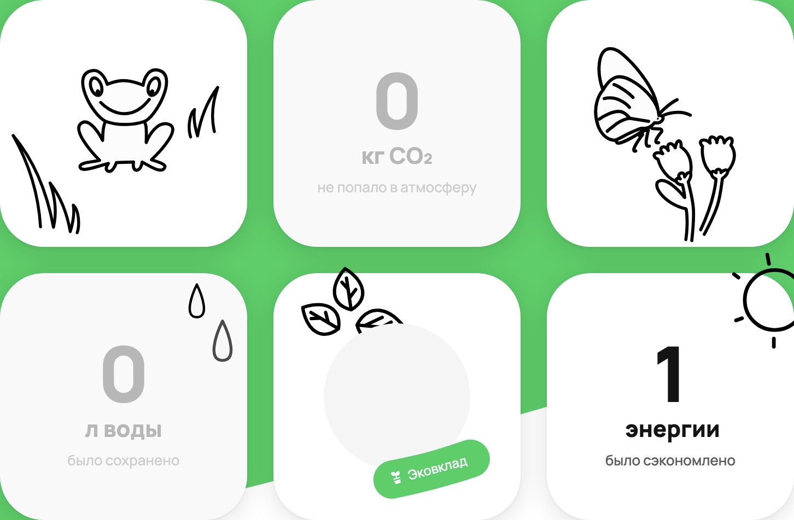

**Ссылка на баг-репорт**

[ID: BR45](BUGS.md)

___
**ID**: 100

**Заголовок**:

Тестирование поля Energy 1000000000000001: Шаг за границу для класса [1000000000000000:1000000000000000000)

**Шаги**:

1. Включаем перезапись запросов в Chrome в Dev Tools
2. Настраиваем перезапись ответа от роута /web/1/charity/ecoImpact/init
на body

`{"result":{"blocks":{"personalImpact":{"data":{"co2":0,"energy":1000000000000001,"water":0,"materials":0,"pineYears":0}}},"isAuthorized":true},"status":"ok"}`

3. Открываем страницу https://www.avito.ru/avito-care/eco-impact

**Ожидаемый результат**:

Верстка отображается корректно
В блоке Energy отображается 1 трлн МВт*ч

**Фактический результат**:

**Ссылка на баг-репорт**

[ID: BR46](BUGS.md)
___
**ID**: 101

**Заголовок**:

Тестирование поля Energy число 576 строкой: Проверка на класс эквивалентности число строкой

**Шаги**:

1. Включаем перезапись запросов в Chrome в Dev Tools
2. Настраиваем перезапись ответа от роута /web/1/charity/ecoImpact/init
на body

`{"result":{"blocks":{"personalImpact":{"data":{"co2":0,"energy":"576","water":0,"materials":0,"pineYears":0}}},"isAuthorized":true},"status":"ok"}`

3. Открываем страницу https://www.avito.ru/avito-care/eco-impact

**Ожидаемый результат**:

Верстка отображается корректно
В блоке Energy отображается 0 кВт*ч

**Фактический результат**:

**Ссылка на баг-репорт**

[ID: BR47](BUGS.md)
___
**ID**: 102

**Заголовок**:

Тестирование поля Energy дробное число 11.6: Проверка на класс эквивалентности число строкой

**Шаги**:

1. Включаем перезапись запросов в Chrome в Dev Tools
2. Настраиваем перезапись ответа от роута /web/1/charity/ecoImpact/init
на body

`{"result":{"blocks":{"personalImpact":{"data":{"co2":0,"water":0,"energy":11.6,"materials":0,"pineYears":0}}},"isAuthorized":true},"status":"ok"}`

3. Открываем страницу https://www.avito.ru/avito-care/eco-impact

**Ожидаемый результат**:

Верстка отображается корректно
В блоке Energy отображается 12 кВт*ч

**Фактический результат**:

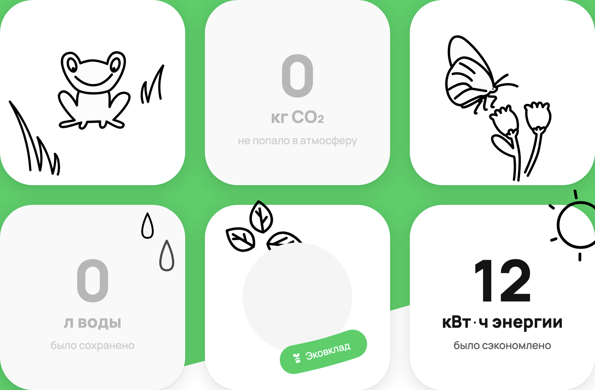

___
**ID**: 103

**Заголовок**:

Тестирование поля Energy null вместо числа: Проверка на класс эквивалентности null

**Шаги**:

1. Включаем перезапись запросов в Chrome в Dev Tools
2. Настраиваем перезапись ответа от роута /web/1/charity/ecoImpact/init
на body

`{"result":{"blocks":{"personalImpact":{"data":{"co2":0,"water":0,"energy":null,"materials":0,"pineYears":0}}},"isAuthorized":true},"status":"ok"}`

3. Открываем страницу https://www.avito.ru/avito-care/eco-impact

**Ожидаемый результат**:

Верстка отображается корректно
В блоке Energy отображается 0 кВт*ч

**Фактический результат**:

___
**ID**: 104

**Заголовок**:

Тестирование поля Energy @ вместо числа: Проверка на класс эквивалентности спецсимвол

**Шаги**:

1. Включаем перезапись запросов в Chrome в Dev Tools
2. Настраиваем перезапись ответа от роута /web/1/charity/ecoImpact/init
на body

`{"result":{"blocks":{"personalImpact":{"data":{"co2":0,"water":0,"energy":"@","materials":0,"pineYears":0}}},"isAuthorized":true},"status":"ok"}`

3. Открываем страницу https://www.avito.ru/avito-care/eco-impact

**Ожидаемый результат**:

Верстка отображается корректно
В блоке Energy отображается 0 кВт*ч

**Фактический результат**:

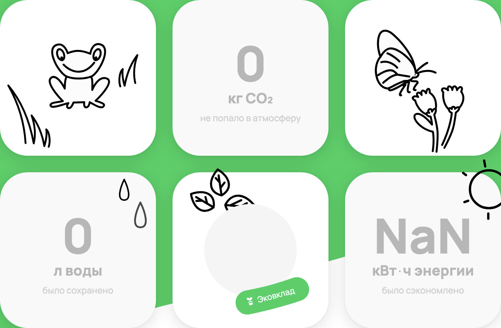

**Ссылка на баг-репорт**

[ID: BR48](BUGS.md)
___
**ID**: 105

**Заголовок**:

Тестирование поля Energy строка abc вместо числа: Проверка на класс эквивалентности буквы

**Шаги**:

1. Включаем перезапись запросов в Chrome в Dev Tools
2. Настраиваем перезапись ответа от роута /web/1/charity/ecoImpact/init
на body

`{"result":{"blocks":{"personalImpact":{"data":{"co2":0,"water":0,"energy":"abc","materials":0,"pineYears":0}}},"isAuthorized":true},"status":"ok"}`

3. Открываем страницу https://www.avito.ru/avito-care/eco-impact

**Ожидаемый результат**:

Верстка отображается корректно
В блоке Energy отображается 0 кВт*ч

**Фактический результат**:

**Ссылка на баг-репорт**

[ID: BR49](BUGS.md)
